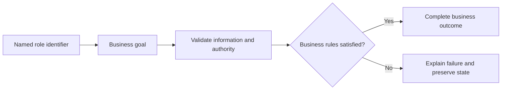

# Agency Management Use Cases

## Personas

| Persona | Role | Responsibility |
|---|---|---|
| Agency Owner X | Agency Owner | Participates in authorized scenarios for this module. |

## Use-case catalog

| ID | Name | Primary actor | Business outcome |
|---|---|---|---|
| UC-1 | Create an agency and resolve owner/geography references | Agency Owner X - Agency Owner | The requested business outcome is completed and visible to the authorized actor. |
| UC-2 | View one agency | Agency Owner X - Agency Owner | The requested business outcome is completed and visible to the authorized actor. |
| UC-3 | Power the paginated remote agency selector | Agency Owner X - Agency Owner | The requested business outcome is completed and visible to the authorized actor. |
| UC-4 | List active agency employees | Agency Owner X - Agency Owner | The requested business outcome is completed and visible to the authorized actor. |
| UC-5 | Return the legacy complete agency list | Agency Owner X - Agency Owner | The requested business outcome is completed and visible to the authorized actor. |
| UC-6 | Add a branch to an agency | Agency Owner X - Agency Owner | The requested business outcome is completed and visible to the authorized actor. |
| UC-7 | List every branch | Agency Owner X - Agency Owner | The requested business outcome is completed and visible to the authorized actor. |
| UC-8 | List active branches for an agency | Agency Owner X - Agency Owner | The requested business outcome is completed and visible to the authorized actor. |
| UC-9 | Power the paginated remote branch selector | Agency Owner X - Agency Owner | The requested business outcome is completed and visible to the authorized actor. |
| UC-10 | List branch employees after ownership validation | Agency Owner X - Agency Owner | The requested business outcome is completed and visible to the authorized actor. |

## UC-1: Create an agency and resolve owner/geography references

### Description

This use case describes the business scenario for create an agency and resolve owner/geography references. It explains the actor's objective, required business conditions, governing rules, expected outcome, and failure behavior. The description remains focused on business behavior and outcomes.

### Actor, preconditions, and trigger

- **Primary actor:** Agency Owner X - Agency Owner
- **Preconditions:** dependencies are available; access is authorized; Agency payload map is valid; referenced records exist.
- **Trigger:** Agency Owner X chooses to create an agency and resolve owner/geography references.

### Main success flow

1. The actor starts the business action.
2. The system validates the supplied business information.
3. Role, ownership, availability, and workflow rules are evaluated.
4. The requested business operation is completed.
5. Related business records remain consistent.
6. The outcome is shown to the authorized actor.

### Business rules

- Role, ownership, and workflow state are verified before mutation.

### Alternative and exception flows

1. Invalid input returns field feedback without mutation.
2. Unauthorized ownership returns access denied without protected data.
3. Missing records return the standard not-found response.
4. Workflow, concurrency, or dependency failure rolls back and returns a safe message.

### Postconditions

- **Success:** The requested business outcome is completed and visible to the authorized actor.
- **Failure:** no invalid, duplicate, unauthorized, or partial state remains.

### Case study

- **Scenario:** Omar manages Al Aradi Travel and Main Branch.
- **Example data:** Agency 3; branch 3.
- **Expected outcome:** Only owned branches and employees are affected.
- **Failure example:** Cross-agency access or duplicate branch name is rejected.
- **Business value:** Confirms realistic behavior, traceability, and data consistency.

---

## UC-2: View one agency

### Description

This use case describes the business scenario for view one agency. It explains the actor's objective, required business conditions, governing rules, expected outcome, and failure behavior. The description remains focused on business behavior and outcomes.

### Actor, preconditions, and trigger

- **Primary actor:** Agency Owner X - Agency Owner
- **Preconditions:** dependencies are available; access is authorized; Numeric agency ID is valid; referenced records exist.
- **Trigger:** Agency Owner X chooses to view one agency.

### Main success flow

1. The actor starts the business action.
2. The system validates the supplied business information.
3. Role, ownership, availability, and workflow rules are evaluated.
4. The requested business operation is completed.
5. Related business records remain consistent.
6. The outcome is shown to the authorized actor.

### Business rules

- Data is scoped to the authorized actor and feature boundary.

### Alternative and exception flows

1. Invalid input returns field feedback without mutation.
2. Unauthorized ownership returns access denied without protected data.
3. Missing records return the standard not-found response.
4. Workflow, concurrency, or dependency failure rolls back and returns a safe message.

### Postconditions

- **Success:** The requested business outcome is completed and visible to the authorized actor.
- **Failure:** no invalid, duplicate, unauthorized, or partial state remains.

### Case study

- **Scenario:** Omar manages Al Aradi Travel and Main Branch.
- **Example data:** Agency 3; branch 3.
- **Expected outcome:** Only owned branches and employees are affected.
- **Failure example:** Cross-agency access or duplicate branch name is rejected.
- **Business value:** Confirms realistic behavior, traceability, and data consistency.

---

## UC-3: Power the paginated remote agency selector

### Description

This use case describes the business scenario for power the paginated remote agency selector. It explains the actor's objective, required business conditions, governing rules, expected outcome, and failure behavior. The description remains focused on business behavior and outcomes.

### Actor, preconditions, and trigger

- **Primary actor:** Agency Owner X - Agency Owner
- **Preconditions:** dependencies are available; access is authorized; `query`, `page`, `size` is valid; referenced records exist.
- **Trigger:** Agency Owner X chooses to power the paginated remote agency selector.

### Main success flow

1. The actor starts the business action.
2. The system validates the supplied business information.
3. Role, ownership, availability, and workflow rules are evaluated.
4. The requested business operation is completed.
5. Related business records remain consistent.
6. The outcome is shown to the authorized actor.

### Business rules

- Data is scoped to the authorized actor and feature boundary.

### Alternative and exception flows

1. Invalid input returns field feedback without mutation.
2. Unauthorized ownership returns access denied without protected data.
3. Missing records return the standard not-found response.
4. Workflow, concurrency, or dependency failure rolls back and returns a safe message.

### Postconditions

- **Success:** The requested business outcome is completed and visible to the authorized actor.
- **Failure:** no invalid, duplicate, unauthorized, or partial state remains.

### Case study

- **Scenario:** Omar manages Al Aradi Travel and Main Branch.
- **Example data:** Agency 3; branch 3.
- **Expected outcome:** Only owned branches and employees are affected.
- **Failure example:** Cross-agency access or duplicate branch name is rejected.
- **Business value:** Confirms realistic behavior, traceability, and data consistency.

---

## UC-4: List active agency employees

### Description

This use case describes the business scenario for list active agency employees. It explains the actor's objective, required business conditions, governing rules, expected outcome, and failure behavior. The description remains focused on business behavior and outcomes.

### Actor, preconditions, and trigger

- **Primary actor:** Agency Owner X - Agency Owner
- **Preconditions:** dependencies are available; access is authorized; Numeric agency ID is valid; referenced records exist.
- **Trigger:** Agency Owner X chooses to list active agency employees.

### Main success flow

1. The actor starts the business action.
2. The system validates the supplied business information.
3. Role, ownership, availability, and workflow rules are evaluated.
4. The requested business operation is completed.
5. Related business records remain consistent.
6. The outcome is shown to the authorized actor.

### Business rules

- Data is scoped to the authorized actor and feature boundary.

### Alternative and exception flows

1. Invalid input returns field feedback without mutation.
2. Unauthorized ownership returns access denied without protected data.
3. Missing records return the standard not-found response.
4. Workflow, concurrency, or dependency failure rolls back and returns a safe message.

### Postconditions

- **Success:** The requested business outcome is completed and visible to the authorized actor.
- **Failure:** no invalid, duplicate, unauthorized, or partial state remains.

### Case study

- **Scenario:** Omar manages Al Aradi Travel and Main Branch.
- **Example data:** Agency 3; branch 3.
- **Expected outcome:** Only owned branches and employees are affected.
- **Failure example:** Cross-agency access or duplicate branch name is rejected.
- **Business value:** Confirms realistic behavior, traceability, and data consistency.

---

## UC-5: Return the legacy complete agency list

### Description

This use case describes the business scenario for return the legacy complete agency list. It explains the actor's objective, required business conditions, governing rules, expected outcome, and failure behavior. The description remains focused on business behavior and outcomes.

### Actor, preconditions, and trigger

- **Primary actor:** Agency Owner X - Agency Owner
- **Preconditions:** dependencies are available; access is authorized; None is valid; referenced records exist.
- **Trigger:** Agency Owner X chooses to return the legacy complete agency list.

### Main success flow

1. The actor starts the business action.
2. The system validates the supplied business information.
3. Role, ownership, availability, and workflow rules are evaluated.
4. The requested business operation is completed.
5. Related business records remain consistent.
6. The outcome is shown to the authorized actor.

### Business rules

- Data is scoped to the authorized actor and feature boundary.

### Alternative and exception flows

1. Invalid input returns field feedback without mutation.
2. Unauthorized ownership returns access denied without protected data.
3. Missing records return the standard not-found response.
4. Workflow, concurrency, or dependency failure rolls back and returns a safe message.

### Postconditions

- **Success:** The requested business outcome is completed and visible to the authorized actor.
- **Failure:** no invalid, duplicate, unauthorized, or partial state remains.

### Case study

- **Scenario:** Omar manages Al Aradi Travel and Main Branch.
- **Example data:** Agency 3; branch 3.
- **Expected outcome:** Only owned branches and employees are affected.
- **Failure example:** Cross-agency access or duplicate branch name is rejected.
- **Business value:** Confirms realistic behavior, traceability, and data consistency.

---

## UC-6: Add a branch to an agency

### Description

This use case describes the business scenario for add a branch to an agency. It explains the actor's objective, required business conditions, governing rules, expected outcome, and failure behavior. The description remains focused on business behavior and outcomes.

### Actor, preconditions, and trigger

- **Primary actor:** Agency Owner X - Agency Owner
- **Preconditions:** dependencies are available; access is authorized; Numeric agency ID and branch body is valid; referenced records exist.
- **Trigger:** Agency Owner X chooses to add a branch to an agency.

### Main success flow

1. The actor starts the business action.
2. The system validates the supplied business information.
3. Role, ownership, availability, and workflow rules are evaluated.
4. The requested business operation is completed.
5. Related business records remain consistent.
6. The outcome is shown to the authorized actor.

### Business rules

- Role, ownership, and workflow state are verified before mutation.

### Alternative and exception flows

1. Invalid input returns field feedback without mutation.
2. Unauthorized ownership returns access denied without protected data.
3. Missing records return the standard not-found response.
4. Workflow, concurrency, or dependency failure rolls back and returns a safe message.

### Postconditions

- **Success:** The requested business outcome is completed and visible to the authorized actor.
- **Failure:** no invalid, duplicate, unauthorized, or partial state remains.

### Case study

- **Scenario:** Omar manages Al Aradi Travel and Main Branch.
- **Example data:** Agency 3; branch 3.
- **Expected outcome:** Only owned branches and employees are affected.
- **Failure example:** Cross-agency access or duplicate branch name is rejected.
- **Business value:** Confirms realistic behavior, traceability, and data consistency.

---

## UC-7: List every branch

### Description

This use case describes the business scenario for list every branch. It explains the actor's objective, required business conditions, governing rules, expected outcome, and failure behavior. The description remains focused on business behavior and outcomes.

### Actor, preconditions, and trigger

- **Primary actor:** Agency Owner X - Agency Owner
- **Preconditions:** dependencies are available; access is authorized; None is valid; referenced records exist.
- **Trigger:** Agency Owner X chooses to list every branch.

### Main success flow

1. The actor starts the business action.
2. The system validates the supplied business information.
3. Role, ownership, availability, and workflow rules are evaluated.
4. The requested business operation is completed.
5. Related business records remain consistent.
6. The outcome is shown to the authorized actor.

### Business rules

- Data is scoped to the authorized actor and feature boundary.

### Alternative and exception flows

1. Invalid input returns field feedback without mutation.
2. Unauthorized ownership returns access denied without protected data.
3. Missing records return the standard not-found response.
4. Workflow, concurrency, or dependency failure rolls back and returns a safe message.

### Postconditions

- **Success:** The requested business outcome is completed and visible to the authorized actor.
- **Failure:** no invalid, duplicate, unauthorized, or partial state remains.

### Case study

- **Scenario:** Omar manages Al Aradi Travel and Main Branch.
- **Example data:** Agency 3; branch 3.
- **Expected outcome:** Only owned branches and employees are affected.
- **Failure example:** Cross-agency access or duplicate branch name is rejected.
- **Business value:** Confirms realistic behavior, traceability, and data consistency.

---

## UC-8: List active branches for an agency

### Description

This use case describes the business scenario for list active branches for an agency. It explains the actor's objective, required business conditions, governing rules, expected outcome, and failure behavior. The description remains focused on business behavior and outcomes.

### Actor, preconditions, and trigger

- **Primary actor:** Agency Owner X - Agency Owner
- **Preconditions:** dependencies are available; access is authorized; Numeric agency ID is valid; referenced records exist.
- **Trigger:** Agency Owner X chooses to list active branches for an agency.

### Main success flow

1. The actor starts the business action.
2. The system validates the supplied business information.
3. Role, ownership, availability, and workflow rules are evaluated.
4. The requested business operation is completed.
5. Related business records remain consistent.
6. The outcome is shown to the authorized actor.

### Business rules

- Data is scoped to the authorized actor and feature boundary.

### Alternative and exception flows

1. Invalid input returns field feedback without mutation.
2. Unauthorized ownership returns access denied without protected data.
3. Missing records return the standard not-found response.
4. Workflow, concurrency, or dependency failure rolls back and returns a safe message.

### Postconditions

- **Success:** The requested business outcome is completed and visible to the authorized actor.
- **Failure:** no invalid, duplicate, unauthorized, or partial state remains.

### Case study

- **Scenario:** Omar manages Al Aradi Travel and Main Branch.
- **Example data:** Agency 3; branch 3.
- **Expected outcome:** Only owned branches and employees are affected.
- **Failure example:** Cross-agency access or duplicate branch name is rejected.
- **Business value:** Confirms realistic behavior, traceability, and data consistency.

---

## UC-9: Power the paginated remote branch selector

### Description

This use case describes the business scenario for power the paginated remote branch selector. It explains the actor's objective, required business conditions, governing rules, expected outcome, and failure behavior. The description remains focused on business behavior and outcomes.

### Actor, preconditions, and trigger

- **Primary actor:** Agency Owner X - Agency Owner
- **Preconditions:** dependencies are available; access is authorized; Agency ID, `query`, `page`, `size` is valid; referenced records exist.
- **Trigger:** Agency Owner X chooses to power the paginated remote branch selector.

### Main success flow

1. The actor starts the business action.
2. The system validates the supplied business information.
3. Role, ownership, availability, and workflow rules are evaluated.
4. The requested business operation is completed.
5. Related business records remain consistent.
6. The outcome is shown to the authorized actor.

### Business rules

- Data is scoped to the authorized actor and feature boundary.

### Alternative and exception flows

1. Invalid input returns field feedback without mutation.
2. Unauthorized ownership returns access denied without protected data.
3. Missing records return the standard not-found response.
4. Workflow, concurrency, or dependency failure rolls back and returns a safe message.

### Postconditions

- **Success:** The requested business outcome is completed and visible to the authorized actor.
- **Failure:** no invalid, duplicate, unauthorized, or partial state remains.

### Case study

- **Scenario:** Omar manages Al Aradi Travel and Main Branch.
- **Example data:** Agency 3; branch 3.
- **Expected outcome:** Only owned branches and employees are affected.
- **Failure example:** Cross-agency access or duplicate branch name is rejected.
- **Business value:** Confirms realistic behavior, traceability, and data consistency.

---

## UC-10: List branch employees after ownership validation

### Description

This use case describes the business scenario for list branch employees after ownership validation. It explains the actor's objective, required business conditions, governing rules, expected outcome, and failure behavior. The description remains focused on business behavior and outcomes.

### Actor, preconditions, and trigger

- **Primary actor:** Agency Owner X - Agency Owner
- **Preconditions:** dependencies are available; access is authorized; Agency and branch IDs is valid; referenced records exist.
- **Trigger:** Agency Owner X chooses to list branch employees after ownership validation.

### Main success flow

1. The actor starts the business action.
2. The system validates the supplied business information.
3. Role, ownership, availability, and workflow rules are evaluated.
4. The requested business operation is completed.
5. Related business records remain consistent.
6. The outcome is shown to the authorized actor.

### Business rules

- Data is scoped to the authorized actor and feature boundary.

### Alternative and exception flows

1. Invalid input returns field feedback without mutation.
2. Unauthorized ownership returns access denied without protected data.
3. Missing records return the standard not-found response.
4. Workflow, concurrency, or dependency failure rolls back and returns a safe message.

### Postconditions

- **Success:** The requested business outcome is completed and visible to the authorized actor.
- **Failure:** no invalid, duplicate, unauthorized, or partial state remains.

### Case study

- **Scenario:** Omar manages Al Aradi Travel and Main Branch.
- **Example data:** Agency 3; branch 3.
- **Expected outcome:** Only owned branches and employees are affected.
- **Failure example:** Cross-agency access or duplicate branch name is rejected.
- **Business value:** Confirms realistic behavior, traceability, and data consistency.

## Use-case overview

