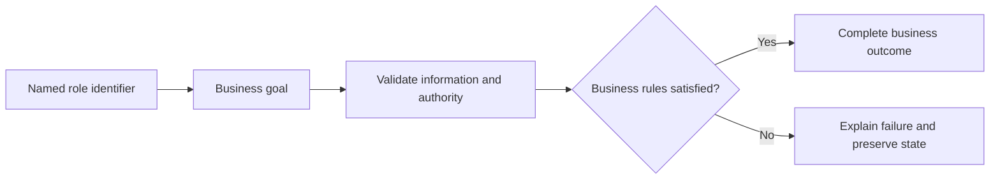

# Geography Management Use Cases

## Personas

| Persona | Role | Responsibility |
|---|---|---|
| Administrator X | Administrator | Participates in authorized scenarios for this module. |

## Use-case catalog

| ID | Name | Primary actor | Business outcome |
|---|---|---|---|
| UC-1 | Populate country selection | Administrator X - Administrator | The requested business outcome is completed and visible to the authorized actor. |
| UC-2 | Add a country manually | Administrator X - Administrator | The requested business outcome is completed and visible to the authorized actor. |
| UC-3 | Import one country from the external provider | Administrator X - Administrator | The requested business outcome is completed and visible to the authorized actor. |
| UC-4 | Synchronize the country catalog | Administrator X - Administrator | The requested business outcome is completed and visible to the authorized actor. |
| UC-5 | Remove a country | Administrator X - Administrator | The requested business outcome is completed and visible to the authorized actor. |
| UC-6 | Populate city selection | Administrator X - Administrator | The requested business outcome is completed and visible to the authorized actor. |
| UC-7 | Return cities within a country | Administrator X - Administrator | The requested business outcome is completed and visible to the authorized actor. |
| UC-8 | Add a city | Administrator X - Administrator | The requested business outcome is completed and visible to the authorized actor. |
| UC-9 | Remove a city | Administrator X - Administrator | The requested business outcome is completed and visible to the authorized actor. |
| UC-10 | List active transport ports | Administrator X - Administrator | The requested business outcome is completed and visible to the authorized actor. |
| UC-11 | Create a transport port | Administrator X - Administrator | The requested business outcome is completed and visible to the authorized actor. |
| UC-12 | Change port lifecycle status | Administrator X - Administrator | The requested business outcome is completed and visible to the authorized actor. |

## UC-1: Populate country selection

### Description

This use case describes the business scenario for populate country selection. It explains the actor's objective, required business conditions, governing rules, expected outcome, and failure behavior. The description remains focused on business behavior and outcomes.

### Actor, preconditions, and trigger

- **Primary actor:** Administrator X - Administrator
- **Preconditions:** dependencies are available; access is authorized; None is valid; referenced records exist.
- **Trigger:** Administrator X chooses to populate country selection.

### Main success flow

1. The actor starts the business action.
2. The system validates the supplied business information.
3. Role, ownership, availability, and workflow rules are evaluated.
4. The requested business operation is completed.
5. Related business records remain consistent.
6. The outcome is shown to the authorized actor.

### Business rules

- Data is scoped to the authorized actor and feature boundary.

### Alternative and exception flows

1. Invalid input returns field feedback without mutation.
2. Unauthorized ownership returns access denied without protected data.
3. Missing records return the standard not-found response.
4. Workflow, concurrency, or dependency failure rolls back and returns a safe message.

### Postconditions

- **Success:** The requested business outcome is completed and visible to the authorized actor.
- **Failure:** no invalid, duplicate, unauthorized, or partial state remains.

### Case study

- **Scenario:** The actor performs populate country selection with realistic feature data.
- **Example data:** Representative feature data that satisfies the stated preconditions.
- **Expected outcome:** Authorized state is returned or committed and displayed.
- **Failure example:** Invalid input or dependency failure leaves no partial state.
- **Business value:** Confirms realistic behavior, traceability, and data consistency.

---

## UC-2: Add a country manually

### Description

This use case describes the business scenario for add a country manually. It explains the actor's objective, required business conditions, governing rules, expected outcome, and failure behavior. The description remains focused on business behavior and outcomes.

### Actor, preconditions, and trigger

- **Primary actor:** Administrator X - Administrator
- **Preconditions:** dependencies are available; access is authorized; `Country` body is valid; referenced records exist.
- **Trigger:** Administrator X chooses to add a country manually.

### Main success flow

1. The actor starts the business action.
2. The system validates the supplied business information.
3. Role, ownership, availability, and workflow rules are evaluated.
4. The requested business operation is completed.
5. Related business records remain consistent.
6. The outcome is shown to the authorized actor.

### Business rules

- Role, ownership, and workflow state are verified before mutation.

### Alternative and exception flows

1. Invalid input returns field feedback without mutation.
2. Unauthorized ownership returns access denied without protected data.
3. Missing records return the standard not-found response.
4. Workflow, concurrency, or dependency failure rolls back and returns a safe message.

### Postconditions

- **Success:** The requested business outcome is completed and visible to the authorized actor.
- **Failure:** no invalid, duplicate, unauthorized, or partial state remains.

### Case study

- **Scenario:** The actor performs add a country manually with realistic feature data.
- **Example data:** Representative feature data that satisfies the stated preconditions.
- **Expected outcome:** Authorized state is returned or committed and displayed.
- **Failure example:** Invalid input or dependency failure leaves no partial state.
- **Business value:** Confirms realistic behavior, traceability, and data consistency.

---

## UC-3: Import one country from the external provider

### Description

This use case describes the business scenario for import one country from the external provider. It explains the actor's objective, required business conditions, governing rules, expected outcome, and failure behavior. The description remains focused on business behavior and outcomes.

### Actor, preconditions, and trigger

- **Primary actor:** Administrator X - Administrator
- **Preconditions:** dependencies are available; access is authorized; Country name is valid; referenced records exist.
- **Trigger:** Administrator X chooses to import one country from the external provider.

### Main success flow

1. The actor starts the business action.
2. The system validates the supplied business information.
3. Role, ownership, availability, and workflow rules are evaluated.
4. The requested business operation is completed.
5. Related business records remain consistent.
6. The outcome is shown to the authorized actor.

### Business rules

- Role, ownership, and workflow state are verified before mutation.

### Alternative and exception flows

1. Invalid input returns field feedback without mutation.
2. Unauthorized ownership returns access denied without protected data.
3. Missing records return the standard not-found response.
4. Workflow, concurrency, or dependency failure rolls back and returns a safe message.

### Postconditions

- **Success:** The requested business outcome is completed and visible to the authorized actor.
- **Failure:** no invalid, duplicate, unauthorized, or partial state remains.

### Case study

- **Scenario:** The actor performs import one country from the external provider with realistic feature data.
- **Example data:** Representative feature data that satisfies the stated preconditions.
- **Expected outcome:** Authorized state is returned or committed and displayed.
- **Failure example:** Invalid input or dependency failure leaves no partial state.
- **Business value:** Confirms realistic behavior, traceability, and data consistency.

---

## UC-4: Synchronize the country catalog

### Description

This use case describes the business scenario for synchronize the country catalog. It explains the actor's objective, required business conditions, governing rules, expected outcome, and failure behavior. The description remains focused on business behavior and outcomes.

### Actor, preconditions, and trigger

- **Primary actor:** Administrator X - Administrator
- **Preconditions:** dependencies are available; access is authorized; None is valid; referenced records exist.
- **Trigger:** Administrator X chooses to synchronize the country catalog.

### Main success flow

1. The actor starts the business action.
2. The system validates the supplied business information.
3. Role, ownership, availability, and workflow rules are evaluated.
4. The requested business operation is completed.
5. Related business records remain consistent.
6. The outcome is shown to the authorized actor.

### Business rules

- Role, ownership, and workflow state are verified before mutation.

### Alternative and exception flows

1. Invalid input returns field feedback without mutation.
2. Unauthorized ownership returns access denied without protected data.
3. Missing records return the standard not-found response.
4. Workflow, concurrency, or dependency failure rolls back and returns a safe message.

### Postconditions

- **Success:** The requested business outcome is completed and visible to the authorized actor.
- **Failure:** no invalid, duplicate, unauthorized, or partial state remains.

### Case study

- **Scenario:** The actor performs synchronize the country catalog with realistic feature data.
- **Example data:** Representative feature data that satisfies the stated preconditions.
- **Expected outcome:** Authorized state is returned or committed and displayed.
- **Failure example:** Invalid input or dependency failure leaves no partial state.
- **Business value:** Confirms realistic behavior, traceability, and data consistency.

---

## UC-5: Remove a country

### Description

This use case describes the business scenario for remove a country. It explains the actor's objective, required business conditions, governing rules, expected outcome, and failure behavior. The description remains focused on business behavior and outcomes.

### Actor, preconditions, and trigger

- **Primary actor:** Administrator X - Administrator
- **Preconditions:** dependencies are available; access is authorized; Country ID is valid; referenced records exist.
- **Trigger:** Administrator X chooses to remove a country.

### Main success flow

1. The actor starts the business action.
2. The system validates the supplied business information.
3. Role, ownership, availability, and workflow rules are evaluated.
4. The requested business operation is completed.
5. Related business records remain consistent.
6. The outcome is shown to the authorized actor.

### Business rules

- Role, ownership, and workflow state are verified before mutation.

### Alternative and exception flows

1. Invalid input returns field feedback without mutation.
2. Unauthorized ownership returns access denied without protected data.
3. Missing records return the standard not-found response.
4. Workflow, concurrency, or dependency failure rolls back and returns a safe message.

### Postconditions

- **Success:** The requested business outcome is completed and visible to the authorized actor.
- **Failure:** no invalid, duplicate, unauthorized, or partial state remains.

### Case study

- **Scenario:** The actor performs remove a country with realistic feature data.
- **Example data:** Representative feature data that satisfies the stated preconditions.
- **Expected outcome:** Authorized state is returned or committed and displayed.
- **Failure example:** Invalid input or dependency failure leaves no partial state.
- **Business value:** Confirms realistic behavior, traceability, and data consistency.

---

## UC-6: Populate city selection

### Description

This use case describes the business scenario for populate city selection. It explains the actor's objective, required business conditions, governing rules, expected outcome, and failure behavior. The description remains focused on business behavior and outcomes.

### Actor, preconditions, and trigger

- **Primary actor:** Administrator X - Administrator
- **Preconditions:** dependencies are available; access is authorized; None is valid; referenced records exist.
- **Trigger:** Administrator X chooses to populate city selection.

### Main success flow

1. The actor starts the business action.
2. The system validates the supplied business information.
3. Role, ownership, availability, and workflow rules are evaluated.
4. The requested business operation is completed.
5. Related business records remain consistent.
6. The outcome is shown to the authorized actor.

### Business rules

- Data is scoped to the authorized actor and feature boundary.

### Alternative and exception flows

1. Invalid input returns field feedback without mutation.
2. Unauthorized ownership returns access denied without protected data.
3. Missing records return the standard not-found response.
4. Workflow, concurrency, or dependency failure rolls back and returns a safe message.

### Postconditions

- **Success:** The requested business outcome is completed and visible to the authorized actor.
- **Failure:** no invalid, duplicate, unauthorized, or partial state remains.

### Case study

- **Scenario:** The actor performs populate city selection with realistic feature data.
- **Example data:** Representative feature data that satisfies the stated preconditions.
- **Expected outcome:** Authorized state is returned or committed and displayed.
- **Failure example:** Invalid input or dependency failure leaves no partial state.
- **Business value:** Confirms realistic behavior, traceability, and data consistency.

---

## UC-7: Return cities within a country

### Description

This use case describes the business scenario for return cities within a country. It explains the actor's objective, required business conditions, governing rules, expected outcome, and failure behavior. The description remains focused on business behavior and outcomes.

### Actor, preconditions, and trigger

- **Primary actor:** Administrator X - Administrator
- **Preconditions:** dependencies are available; access is authorized; Country ID is valid; referenced records exist.
- **Trigger:** Administrator X chooses to return cities within a country.

### Main success flow

1. The actor starts the business action.
2. The system validates the supplied business information.
3. Role, ownership, availability, and workflow rules are evaluated.
4. The requested business operation is completed.
5. Related business records remain consistent.
6. The outcome is shown to the authorized actor.

### Business rules

- Data is scoped to the authorized actor and feature boundary.

### Alternative and exception flows

1. Invalid input returns field feedback without mutation.
2. Unauthorized ownership returns access denied without protected data.
3. Missing records return the standard not-found response.
4. Workflow, concurrency, or dependency failure rolls back and returns a safe message.

### Postconditions

- **Success:** The requested business outcome is completed and visible to the authorized actor.
- **Failure:** no invalid, duplicate, unauthorized, or partial state remains.

### Case study

- **Scenario:** The actor performs return cities within a country with realistic feature data.
- **Example data:** Representative feature data that satisfies the stated preconditions.
- **Expected outcome:** Authorized state is returned or committed and displayed.
- **Failure example:** Invalid input or dependency failure leaves no partial state.
- **Business value:** Confirms realistic behavior, traceability, and data consistency.

---

## UC-8: Add a city

### Description

This use case describes the business scenario for add a city. It explains the actor's objective, required business conditions, governing rules, expected outcome, and failure behavior. The description remains focused on business behavior and outcomes.

### Actor, preconditions, and trigger

- **Primary actor:** Administrator X - Administrator
- **Preconditions:** dependencies are available; access is authorized; `City` body is valid; referenced records exist.
- **Trigger:** Administrator X chooses to add a city.

### Main success flow

1. The actor starts the business action.
2. The system validates the supplied business information.
3. Role, ownership, availability, and workflow rules are evaluated.
4. The requested business operation is completed.
5. Related business records remain consistent.
6. The outcome is shown to the authorized actor.

### Business rules

- Role, ownership, and workflow state are verified before mutation.

### Alternative and exception flows

1. Invalid input returns field feedback without mutation.
2. Unauthorized ownership returns access denied without protected data.
3. Missing records return the standard not-found response.
4. Workflow, concurrency, or dependency failure rolls back and returns a safe message.

### Postconditions

- **Success:** The requested business outcome is completed and visible to the authorized actor.
- **Failure:** no invalid, duplicate, unauthorized, or partial state remains.

### Case study

- **Scenario:** The actor performs add a city with realistic feature data.
- **Example data:** Representative feature data that satisfies the stated preconditions.
- **Expected outcome:** Authorized state is returned or committed and displayed.
- **Failure example:** Invalid input or dependency failure leaves no partial state.
- **Business value:** Confirms realistic behavior, traceability, and data consistency.

---

## UC-9: Remove a city

### Description

This use case describes the business scenario for remove a city. It explains the actor's objective, required business conditions, governing rules, expected outcome, and failure behavior. The description remains focused on business behavior and outcomes.

### Actor, preconditions, and trigger

- **Primary actor:** Administrator X - Administrator
- **Preconditions:** dependencies are available; access is authorized; City ID is valid; referenced records exist.
- **Trigger:** Administrator X chooses to remove a city.

### Main success flow

1. The actor starts the business action.
2. The system validates the supplied business information.
3. Role, ownership, availability, and workflow rules are evaluated.
4. The requested business operation is completed.
5. Related business records remain consistent.
6. The outcome is shown to the authorized actor.

### Business rules

- Role, ownership, and workflow state are verified before mutation.

### Alternative and exception flows

1. Invalid input returns field feedback without mutation.
2. Unauthorized ownership returns access denied without protected data.
3. Missing records return the standard not-found response.
4. Workflow, concurrency, or dependency failure rolls back and returns a safe message.

### Postconditions

- **Success:** The requested business outcome is completed and visible to the authorized actor.
- **Failure:** no invalid, duplicate, unauthorized, or partial state remains.

### Case study

- **Scenario:** The actor performs remove a city with realistic feature data.
- **Example data:** Representative feature data that satisfies the stated preconditions.
- **Expected outcome:** Authorized state is returned or committed and displayed.
- **Failure example:** Invalid input or dependency failure leaves no partial state.
- **Business value:** Confirms realistic behavior, traceability, and data consistency.

---

## UC-10: List active transport ports

### Description

This use case describes the business scenario for list active transport ports. It explains the actor's objective, required business conditions, governing rules, expected outcome, and failure behavior. The description remains focused on business behavior and outcomes.

### Actor, preconditions, and trigger

- **Primary actor:** Administrator X - Administrator
- **Preconditions:** dependencies are available; access is authorized; None is valid; referenced records exist.
- **Trigger:** Administrator X chooses to list active transport ports.

### Main success flow

1. The actor starts the business action.
2. The system validates the supplied business information.
3. Role, ownership, availability, and workflow rules are evaluated.
4. The requested business operation is completed.
5. Related business records remain consistent.
6. The outcome is shown to the authorized actor.

### Business rules

- Data is scoped to the authorized actor and feature boundary.

### Alternative and exception flows

1. Invalid input returns field feedback without mutation.
2. Unauthorized ownership returns access denied without protected data.
3. Missing records return the standard not-found response.
4. Workflow, concurrency, or dependency failure rolls back and returns a safe message.

### Postconditions

- **Success:** The requested business outcome is completed and visible to the authorized actor.
- **Failure:** no invalid, duplicate, unauthorized, or partial state remains.

### Case study

- **Scenario:** The actor performs list active transport ports with realistic feature data.
- **Example data:** Representative feature data that satisfies the stated preconditions.
- **Expected outcome:** Authorized state is returned or committed and displayed.
- **Failure example:** Invalid input or dependency failure leaves no partial state.
- **Business value:** Confirms realistic behavior, traceability, and data consistency.

---

## UC-11: Create a transport port

### Description

This use case describes the business scenario for create a transport port. It explains the actor's objective, required business conditions, governing rules, expected outcome, and failure behavior. The description remains focused on business behavior and outcomes.

### Actor, preconditions, and trigger

- **Primary actor:** Administrator X - Administrator
- **Preconditions:** dependencies are available; access is authorized; Validated `Port` is valid; referenced records exist.
- **Trigger:** Administrator X chooses to create a transport port.

### Main success flow

1. The actor starts the business action.
2. The system validates the supplied business information.
3. Role, ownership, availability, and workflow rules are evaluated.
4. The requested business operation is completed.
5. Related business records remain consistent.
6. The outcome is shown to the authorized actor.

### Business rules

- Role, ownership, and workflow state are verified before mutation.

### Alternative and exception flows

1. Invalid input returns field feedback without mutation.
2. Unauthorized ownership returns access denied without protected data.
3. Missing records return the standard not-found response.
4. Workflow, concurrency, or dependency failure rolls back and returns a safe message.

### Postconditions

- **Success:** The requested business outcome is completed and visible to the authorized actor.
- **Failure:** no invalid, duplicate, unauthorized, or partial state remains.

### Case study

- **Scenario:** The actor performs create a transport port with realistic feature data.
- **Example data:** Representative feature data that satisfies the stated preconditions.
- **Expected outcome:** Authorized state is returned or committed and displayed.
- **Failure example:** Invalid input or dependency failure leaves no partial state.
- **Business value:** Confirms realistic behavior, traceability, and data consistency.

---

## UC-12: Change port lifecycle status

### Description

This use case describes the business scenario for change port lifecycle status. It explains the actor's objective, required business conditions, governing rules, expected outcome, and failure behavior. The description remains focused on business behavior and outcomes.

### Actor, preconditions, and trigger

- **Primary actor:** Administrator X - Administrator
- **Preconditions:** dependencies are available; access is authorized; Port ID and status is valid; referenced records exist.
- **Trigger:** Administrator X chooses to change port lifecycle status.

### Main success flow

1. The actor starts the business action.
2. The system validates the supplied business information.
3. Role, ownership, availability, and workflow rules are evaluated.
4. The requested business operation is completed.
5. Related business records remain consistent.
6. The outcome is shown to the authorized actor.

### Business rules

- Role, ownership, and workflow state are verified before mutation.

### Alternative and exception flows

1. Invalid input returns field feedback without mutation.
2. Unauthorized ownership returns access denied without protected data.
3. Missing records return the standard not-found response.
4. Workflow, concurrency, or dependency failure rolls back and returns a safe message.

### Postconditions

- **Success:** The requested business outcome is completed and visible to the authorized actor.
- **Failure:** no invalid, duplicate, unauthorized, or partial state remains.

### Case study

- **Scenario:** The actor performs change port lifecycle status with realistic feature data.
- **Example data:** Representative feature data that satisfies the stated preconditions.
- **Expected outcome:** Authorized state is returned or committed and displayed.
- **Failure example:** Invalid input or dependency failure leaves no partial state.
- **Business value:** Confirms realistic behavior, traceability, and data consistency.

## Use-case overview

