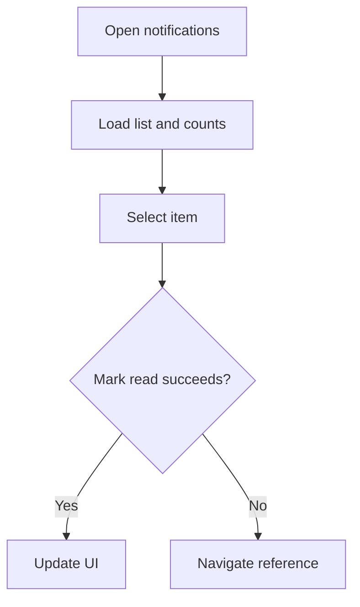
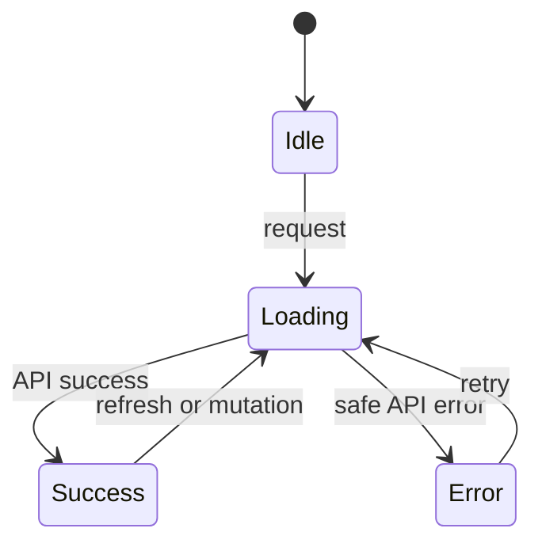

# Notification UI Flowcharts

## FC-1: User interaction flow

```mermaid
flowchart TD
    A[Open notifications] --> B[Load list and counts]
    B --> C[Select item]
    C --> D{Mark read succeeds?}
    D -- Yes --> E[Update UI]
    D -- No --> X[Navigate reference]
```

## FC-2: API state flow

```mermaid
stateDiagram-v2
    [*] --> Idle
    Idle --> Loading: request
    Loading --> Success: API success
    Loading --> Error: safe API error
    Error --> Loading: retry
    Success --> Loading: refresh or mutation
```

