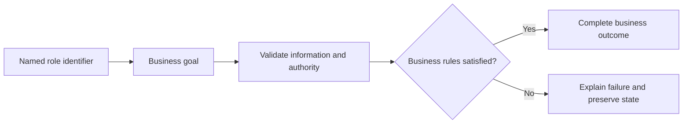

# Notification Management Use Cases

## Personas

| Persona | Role | Responsibility |
|---|---|---|
| Customer Y | Customer | Participates in authorized scenarios for this module. |

## Use-case catalog

| ID | Name | Primary actor | Business outcome |
|---|---|---|---|
| UC-1 | Show a user's notifications | Customer Y - Customer | The requested business outcome is completed and visible to the authorized actor. |
| UC-2 | Mark a notification read | Customer Y - Customer | The requested business outcome is completed and visible to the authorized actor. |
| UC-3 | Show unread/total counters | Customer Y - Customer | The requested business outcome is completed and visible to the authorized actor. |

## UC-1: Show a user's notifications

### Description

This use case describes the business scenario for show a user's notifications. It explains the actor's objective, required business conditions, governing rules, expected outcome, and failure behavior. The description remains focused on business behavior and outcomes.

### Actor, preconditions, and trigger

- **Primary actor:** Customer Y - Customer
- **Preconditions:** dependencies are available; access is authorized; User ID is valid; referenced records exist.
- **Trigger:** Customer Y chooses to show a user's notifications.

### Main success flow

1. The actor starts the business action.
2. The system validates the supplied business information.
3. Role, ownership, availability, and workflow rules are evaluated.
4. The requested business operation is completed.
5. Related business records remain consistent.
6. The outcome is shown to the authorized actor.

### Business rules

- Data is scoped to the authorized actor and feature boundary.

### Alternative and exception flows

1. Invalid input returns field feedback without mutation.
2. Unauthorized ownership returns access denied without protected data.
3. Missing records return the standard not-found response.
4. Workflow, concurrency, or dependency failure rolls back and returns a safe message.

### Postconditions

- **Success:** The requested business outcome is completed and visible to the authorized actor.
- **Failure:** no invalid, duplicate, unauthorized, or partial state remains.

### Case study

- **Scenario:** The actor performs show a user's notifications with realistic feature data.
- **Example data:** Representative feature data that satisfies the stated preconditions.
- **Expected outcome:** Authorized state is returned or committed and displayed.
- **Failure example:** Invalid input or dependency failure leaves no partial state.
- **Business value:** Confirms realistic behavior, traceability, and data consistency.

---

## UC-2: Mark a notification read

### Description

This use case describes the business scenario for mark a notification read. It explains the actor's objective, required business conditions, governing rules, expected outcome, and failure behavior. The description remains focused on business behavior and outcomes.

### Actor, preconditions, and trigger

- **Primary actor:** Customer Y - Customer
- **Preconditions:** dependencies are available; access is authorized; Notification ID is valid; referenced records exist.
- **Trigger:** Customer Y chooses to mark a notification read.

### Main success flow

1. The actor starts the business action.
2. The system validates the supplied business information.
3. Role, ownership, availability, and workflow rules are evaluated.
4. The requested business operation is completed.
5. Related business records remain consistent.
6. The outcome is shown to the authorized actor.

### Business rules

- Role, ownership, and workflow state are verified before mutation.

### Alternative and exception flows

1. Invalid input returns field feedback without mutation.
2. Unauthorized ownership returns access denied without protected data.
3. Missing records return the standard not-found response.
4. Workflow, concurrency, or dependency failure rolls back and returns a safe message.

### Postconditions

- **Success:** The requested business outcome is completed and visible to the authorized actor.
- **Failure:** no invalid, duplicate, unauthorized, or partial state remains.

### Case study

- **Scenario:** The actor performs mark a notification read with realistic feature data.
- **Example data:** Representative feature data that satisfies the stated preconditions.
- **Expected outcome:** Authorized state is returned or committed and displayed.
- **Failure example:** Invalid input or dependency failure leaves no partial state.
- **Business value:** Confirms realistic behavior, traceability, and data consistency.

---

## UC-3: Show unread/total counters

### Description

This use case describes the business scenario for show unread/total counters. It explains the actor's objective, required business conditions, governing rules, expected outcome, and failure behavior. The description remains focused on business behavior and outcomes.

### Actor, preconditions, and trigger

- **Primary actor:** Customer Y - Customer
- **Preconditions:** dependencies are available; access is authorized; User ID is valid; referenced records exist.
- **Trigger:** Customer Y chooses to show unread/total counters.

### Main success flow

1. The actor starts the business action.
2. The system validates the supplied business information.
3. Role, ownership, availability, and workflow rules are evaluated.
4. The requested business operation is completed.
5. Related business records remain consistent.
6. The outcome is shown to the authorized actor.

### Business rules

- Data is scoped to the authorized actor and feature boundary.

### Alternative and exception flows

1. Invalid input returns field feedback without mutation.
2. Unauthorized ownership returns access denied without protected data.
3. Missing records return the standard not-found response.
4. Workflow, concurrency, or dependency failure rolls back and returns a safe message.

### Postconditions

- **Success:** The requested business outcome is completed and visible to the authorized actor.
- **Failure:** no invalid, duplicate, unauthorized, or partial state remains.

### Case study

- **Scenario:** The actor performs show unread/total counters with realistic feature data.
- **Example data:** Representative feature data that satisfies the stated preconditions.
- **Expected outcome:** Authorized state is returned or committed and displayed.
- **Failure example:** Invalid input or dependency failure leaves no partial state.
- **Business value:** Confirms realistic behavior, traceability, and data consistency.

## Use-case overview

