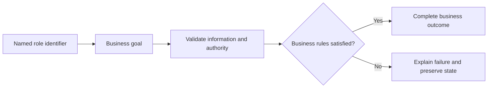

# Payment Management Use Cases

## Personas

| Persona | Role | Responsibility |
|---|---|---|
| Customer Y | Customer | Participates in authorized scenarios for this module. |
| Administrator X | Administrator | Participates in authorized scenarios for this module. |

## Use-case catalog

| ID | Name | Primary actor | Business outcome |
|---|---|---|---|
| UC-1 | Supply publishable payment configuration | Customer Y - Customer | The requested business outcome is completed and visible to the authorized actor. |
| UC-2 | Add externally paid funds to a wallet | Customer Y - Customer | The requested business outcome is completed and visible to the authorized actor. |
| UC-3 | Pay and finalize a held reservation | Customer Y - Customer | The requested business outcome is completed and visible to the authorized actor. |
| UC-4 | Search payments by owner, status, method, or dates | Customer Y - Customer | The requested business outcome is completed and visible to the authorized actor. |
| UC-5 | View one authorized payment | Customer Y - Customer | The requested business outcome is completed and visible to the authorized actor. |
| UC-6 | Search account transactions | Administrator X - Administrator | The requested business outcome is completed and visible to the authorized actor. |
| UC-7 | View one authorized transaction | Administrator X - Administrator | The requested business outcome is completed and visible to the authorized actor. |
| UC-8 | Apply an administrative wallet credit | Administrator X - Administrator | The requested business outcome is completed and visible to the authorized actor. |

## UC-1: Supply publishable payment configuration

### Description

This use case describes the business scenario for supply publishable payment configuration. It explains the actor's objective, required business conditions, governing rules, expected outcome, and failure behavior. The description remains focused on business behavior and outcomes.

### Actor, preconditions, and trigger

- **Primary actor:** Customer Y - Customer
- **Preconditions:** dependencies are available; access is authorized; None is valid; referenced records exist.
- **Trigger:** Customer Y chooses to supply publishable payment configuration.

### Main success flow

1. The actor starts the business action.
2. The system validates the supplied business information.
3. Role, ownership, availability, and workflow rules are evaluated.
4. The requested business operation is completed.
5. Related business records remain consistent.
6. The outcome is shown to the authorized actor.

### Business rules

- Data is scoped to the authorized actor and feature boundary.
- Money movement is idempotent and auditable.

### Alternative and exception flows

1. Invalid input returns field feedback without mutation.
2. Unauthorized ownership returns access denied without protected data.
3. Missing records return the standard not-found response.
4. Workflow, concurrency, or dependency failure rolls back and returns a safe message.

### Postconditions

- **Success:** The requested business outcome is completed and visible to the authorized actor.
- **Failure:** no invalid, duplicate, unauthorized, or partial state remains.

### Case study

- **Scenario:** Yusuf pays BHD 158 for reservation RES-A12BC34D using his wallet.
- **Example data:** Wallet BHD 200; method WALLET.
- **Expected outcome:** One payment and one ledger debit confirm the booking.
- **Failure example:** Low balance or retry never duplicates the charge.
- **Business value:** Confirms realistic behavior, traceability, and data consistency.

---

## UC-2: Add externally paid funds to a wallet

### Description

This use case describes the business scenario for add externally paid funds to a wallet. It explains the actor's objective, required business conditions, governing rules, expected outcome, and failure behavior. The description remains focused on business behavior and outcomes.

### Actor, preconditions, and trigger

- **Primary actor:** Customer Y - Customer
- **Preconditions:** dependencies are available; access is authorized; Amount, method, optional Stripe token is valid; referenced records exist.
- **Trigger:** Customer Y chooses to add externally paid funds to a wallet.

### Main success flow

1. The actor starts the business action.
2. The system validates the supplied business information.
3. Role, ownership, availability, and workflow rules are evaluated.
4. The requested business operation is completed.
5. Related business records remain consistent.
6. The outcome is shown to the authorized actor.

### Business rules

- Role, ownership, and workflow state are verified before mutation.
- Money movement is idempotent and auditable.

### Alternative and exception flows

1. Invalid input returns field feedback without mutation.
2. Unauthorized ownership returns access denied without protected data.
3. Missing records return the standard not-found response.
4. Workflow, concurrency, or dependency failure rolls back and returns a safe message.

### Postconditions

- **Success:** The requested business outcome is completed and visible to the authorized actor.
- **Failure:** no invalid, duplicate, unauthorized, or partial state remains.

### Case study

- **Scenario:** Yusuf pays BHD 158 for reservation RES-A12BC34D using his wallet.
- **Example data:** Wallet BHD 200; method WALLET.
- **Expected outcome:** One payment and one ledger debit confirm the booking.
- **Failure example:** Low balance or retry never duplicates the charge.
- **Business value:** Confirms realistic behavior, traceability, and data consistency.

---

## UC-3: Pay and finalize a held reservation

### Description

This use case describes the business scenario for pay and finalize a held reservation. It explains the actor's objective, required business conditions, governing rules, expected outcome, and failure behavior. The description remains focused on business behavior and outcomes.

### Actor, preconditions, and trigger

- **Primary actor:** Customer Y - Customer
- **Preconditions:** dependencies are available; access is authorized; Reservation ID and payment method is valid; referenced records exist.
- **Trigger:** Customer Y chooses to pay and finalize a held reservation.

### Main success flow

1. The actor starts the business action.
2. The system validates the supplied business information.
3. Role, ownership, availability, and workflow rules are evaluated.
4. The requested business operation is completed.
5. Related business records remain consistent.
6. The outcome is shown to the authorized actor.

### Business rules

- Role, ownership, and workflow state are verified before mutation.
- Hold expiry, capacity, seats, and reservation status stay consistent.
- Money movement is idempotent and auditable.

### Alternative and exception flows

1. Invalid input returns field feedback without mutation.
2. Unauthorized ownership returns access denied without protected data.
3. Missing records return the standard not-found response.
4. Workflow, concurrency, or dependency failure rolls back and returns a safe message.

### Postconditions

- **Success:** The requested business outcome is completed and visible to the authorized actor.
- **Failure:** no invalid, duplicate, unauthorized, or partial state remains.

### Case study

- **Scenario:** Yusuf pays BHD 158 for reservation RES-A12BC34D using his wallet.
- **Example data:** Wallet BHD 200; method WALLET.
- **Expected outcome:** One payment and one ledger debit confirm the booking.
- **Failure example:** Low balance or retry never duplicates the charge.
- **Business value:** Confirms realistic behavior, traceability, and data consistency.

---

## UC-4: Search payments by owner, status, method, or dates

### Description

This use case describes the business scenario for search payments by owner, status, method, or dates. It explains the actor's objective, required business conditions, governing rules, expected outcome, and failure behavior. The description remains focused on business behavior and outcomes.

### Actor, preconditions, and trigger

- **Primary actor:** Customer Y - Customer
- **Preconditions:** dependencies are available; access is authorized; `PaymentFilterRequest` is valid; referenced records exist.
- **Trigger:** Customer Y chooses to search payments by owner, status, method, or dates.

### Main success flow

1. The actor starts the business action.
2. The system validates the supplied business information.
3. Role, ownership, availability, and workflow rules are evaluated.
4. The requested business operation is completed.
5. Related business records remain consistent.
6. The outcome is shown to the authorized actor.

### Business rules

- Data is scoped to the authorized actor and feature boundary.
- Money movement is idempotent and auditable.

### Alternative and exception flows

1. Invalid input returns field feedback without mutation.
2. Unauthorized ownership returns access denied without protected data.
3. Missing records return the standard not-found response.
4. Workflow, concurrency, or dependency failure rolls back and returns a safe message.

### Postconditions

- **Success:** The requested business outcome is completed and visible to the authorized actor.
- **Failure:** no invalid, duplicate, unauthorized, or partial state remains.

### Case study

- **Scenario:** Yusuf pays BHD 158 for reservation RES-A12BC34D using his wallet.
- **Example data:** Wallet BHD 200; method WALLET.
- **Expected outcome:** One payment and one ledger debit confirm the booking.
- **Failure example:** Low balance or retry never duplicates the charge.
- **Business value:** Confirms realistic behavior, traceability, and data consistency.

---

## UC-5: View one authorized payment

### Description

This use case describes the business scenario for view one authorized payment. It explains the actor's objective, required business conditions, governing rules, expected outcome, and failure behavior. The description remains focused on business behavior and outcomes.

### Actor, preconditions, and trigger

- **Primary actor:** Customer Y - Customer
- **Preconditions:** dependencies are available; access is authorized; Payment ID is valid; referenced records exist.
- **Trigger:** Customer Y chooses to view one authorized payment.

### Main success flow

1. The actor starts the business action.
2. The system validates the supplied business information.
3. Role, ownership, availability, and workflow rules are evaluated.
4. The requested business operation is completed.
5. Related business records remain consistent.
6. The outcome is shown to the authorized actor.

### Business rules

- Data is scoped to the authorized actor and feature boundary.
- Money movement is idempotent and auditable.

### Alternative and exception flows

1. Invalid input returns field feedback without mutation.
2. Unauthorized ownership returns access denied without protected data.
3. Missing records return the standard not-found response.
4. Workflow, concurrency, or dependency failure rolls back and returns a safe message.

### Postconditions

- **Success:** The requested business outcome is completed and visible to the authorized actor.
- **Failure:** no invalid, duplicate, unauthorized, or partial state remains.

### Case study

- **Scenario:** Yusuf pays BHD 158 for reservation RES-A12BC34D using his wallet.
- **Example data:** Wallet BHD 200; method WALLET.
- **Expected outcome:** One payment and one ledger debit confirm the booking.
- **Failure example:** Low balance or retry never duplicates the charge.
- **Business value:** Confirms realistic behavior, traceability, and data consistency.

---

## UC-6: Search account transactions

### Description

This use case describes the business scenario for search account transactions. It explains the actor's objective, required business conditions, governing rules, expected outcome, and failure behavior. The description remains focused on business behavior and outcomes.

### Actor, preconditions, and trigger

- **Primary actor:** Administrator X - Administrator
- **Preconditions:** dependencies are available; access is authorized; `TransactionFilterRequest` is valid; referenced records exist.
- **Trigger:** Administrator X chooses to search account transactions.

### Main success flow

1. The actor starts the business action.
2. The system validates the supplied business information.
3. Role, ownership, availability, and workflow rules are evaluated.
4. The requested business operation is completed.
5. Related business records remain consistent.
6. The outcome is shown to the authorized actor.

### Business rules

- Data is scoped to the authorized actor and feature boundary.
- Money movement is idempotent and auditable.

### Alternative and exception flows

1. Invalid input returns field feedback without mutation.
2. Unauthorized ownership returns access denied without protected data.
3. Missing records return the standard not-found response.
4. Workflow, concurrency, or dependency failure rolls back and returns a safe message.

### Postconditions

- **Success:** The requested business outcome is completed and visible to the authorized actor.
- **Failure:** no invalid, duplicate, unauthorized, or partial state remains.

### Case study

- **Scenario:** The actor performs search account transactions with realistic feature data.
- **Example data:** Representative feature data that satisfies the stated preconditions.
- **Expected outcome:** Authorized state is returned or committed and displayed.
- **Failure example:** Invalid input or dependency failure leaves no partial state.
- **Business value:** Confirms realistic behavior, traceability, and data consistency.

---

## UC-7: View one authorized transaction

### Description

This use case describes the business scenario for view one authorized transaction. It explains the actor's objective, required business conditions, governing rules, expected outcome, and failure behavior. The description remains focused on business behavior and outcomes.

### Actor, preconditions, and trigger

- **Primary actor:** Administrator X - Administrator
- **Preconditions:** dependencies are available; access is authorized; Transaction ID is valid; referenced records exist.
- **Trigger:** Administrator X chooses to view one authorized transaction.

### Main success flow

1. The actor starts the business action.
2. The system validates the supplied business information.
3. Role, ownership, availability, and workflow rules are evaluated.
4. The requested business operation is completed.
5. Related business records remain consistent.
6. The outcome is shown to the authorized actor.

### Business rules

- Data is scoped to the authorized actor and feature boundary.
- Money movement is idempotent and auditable.

### Alternative and exception flows

1. Invalid input returns field feedback without mutation.
2. Unauthorized ownership returns access denied without protected data.
3. Missing records return the standard not-found response.
4. Workflow, concurrency, or dependency failure rolls back and returns a safe message.

### Postconditions

- **Success:** The requested business outcome is completed and visible to the authorized actor.
- **Failure:** no invalid, duplicate, unauthorized, or partial state remains.

### Case study

- **Scenario:** The actor performs view one authorized transaction with realistic feature data.
- **Example data:** Representative feature data that satisfies the stated preconditions.
- **Expected outcome:** Authorized state is returned or committed and displayed.
- **Failure example:** Invalid input or dependency failure leaves no partial state.
- **Business value:** Confirms realistic behavior, traceability, and data consistency.

---

## UC-8: Apply an administrative wallet credit

### Description

This use case describes the business scenario for apply an administrative wallet credit. It explains the actor's objective, required business conditions, governing rules, expected outcome, and failure behavior. The description remains focused on business behavior and outcomes.

### Actor, preconditions, and trigger

- **Primary actor:** Administrator X - Administrator
- **Preconditions:** dependencies are available; access is authorized; User ID, amount, description is valid; referenced records exist.
- **Trigger:** Administrator X chooses to apply an administrative wallet credit.

### Main success flow

1. The actor starts the business action.
2. The system validates the supplied business information.
3. Role, ownership, availability, and workflow rules are evaluated.
4. The requested business operation is completed.
5. Related business records remain consistent.
6. The outcome is shown to the authorized actor.

### Business rules

- Role, ownership, and workflow state are verified before mutation.
- Money movement is idempotent and auditable.

### Alternative and exception flows

1. Invalid input returns field feedback without mutation.
2. Unauthorized ownership returns access denied without protected data.
3. Missing records return the standard not-found response.
4. Workflow, concurrency, or dependency failure rolls back and returns a safe message.

### Postconditions

- **Success:** The requested business outcome is completed and visible to the authorized actor.
- **Failure:** no invalid, duplicate, unauthorized, or partial state remains.

### Case study

- **Scenario:** The actor performs apply an administrative wallet credit with realistic feature data.
- **Example data:** Representative feature data that satisfies the stated preconditions.
- **Expected outcome:** Authorized state is returned or committed and displayed.
- **Failure example:** Invalid input or dependency failure leaves no partial state.
- **Business value:** Confirms realistic behavior, traceability, and data consistency.

## Use-case overview

