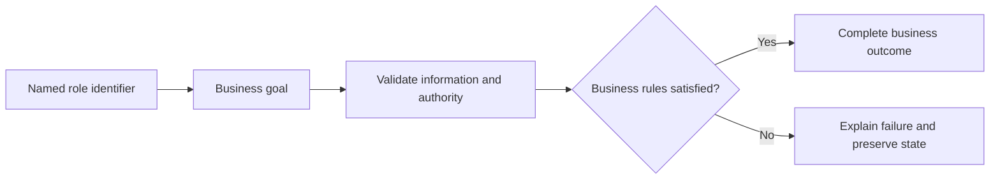

# Support Management Use Cases

## Personas

| Persona | Role | Responsibility |
|---|---|---|
| Support Agent X | Support Agent | Participates in authorized scenarios for this module. |

## Use-case catalog

| ID | Name | Primary actor | Business outcome |
|---|---|---|---|
| UC-1 | Open a support request | Support Agent X - Support Agent | The requested business outcome is completed and visible to the authorized actor. |
| UC-2 | Search support requests | Support Agent X - Support Agent | The requested business outcome is completed and visible to the authorized actor. |
| UC-3 | View one request | Support Agent X - Support Agent | The requested business outcome is completed and visible to the authorized actor. |
| UC-4 | Assign support ownership | Support Agent X - Support Agent | The requested business outcome is completed and visible to the authorized actor. |
| UC-5 | Resolve a support request | Support Agent X - Support Agent | The requested business outcome is completed and visible to the authorized actor. |
| UC-6 | Reject a support request | Support Agent X - Support Agent | The requested business outcome is completed and visible to the authorized actor. |
| UC-7 | Delete an eligible request | Support Agent X - Support Agent | The requested business outcome is completed and visible to the authorized actor. |
| UC-8 | Read comments and event history for a domain record | Support Agent X - Support Agent | The requested business outcome is completed and visible to the authorized actor. |
| UC-9 | Add an auditable comment | Support Agent X - Support Agent | The requested business outcome is completed and visible to the authorized actor. |
| UC-10 | Edit the author's comment | Support Agent X - Support Agent | The requested business outcome is completed and visible to the authorized actor. |

## UC-1: Open a support request

### Description

This use case describes the business scenario for open a support request. It explains the actor's objective, required business conditions, governing rules, expected outcome, and failure behavior. The description remains focused on business behavior and outcomes.

### Actor, preconditions, and trigger

- **Primary actor:** Support Agent X - Support Agent
- **Preconditions:** dependencies are available; access is authorized; Validated `UserRequest` is valid; referenced records exist.
- **Trigger:** Support Agent X chooses to open a support request.

### Main success flow

1. The actor starts the business action.
2. The system validates the supplied business information.
3. Role, ownership, availability, and workflow rules are evaluated.
4. The requested business operation is completed.
5. Related business records remain consistent.
6. The outcome is shown to the authorized actor.

### Business rules

- Role, ownership, and workflow state are verified before mutation.

### Alternative and exception flows

1. Invalid input returns field feedback without mutation.
2. Unauthorized ownership returns access denied without protected data.
3. Missing records return the standard not-found response.
4. Workflow, concurrency, or dependency failure rolls back and returns a safe message.

### Postconditions

- **Success:** The requested business outcome is completed and visible to the authorized actor.
- **Failure:** no invalid, duplicate, unauthorized, or partial state remains.

### Case study

- **Scenario:** Yusuf reports a missing ticket and Sara handles it.
- **Example data:** HIGH priority; OPEN request.
- **Expected outcome:** Assignment, comments, resolution, and audit history persist.
- **Failure example:** Closed requests and unauthorized edits are rejected.
- **Business value:** Confirms realistic behavior, traceability, and data consistency.

---

## UC-2: Search support requests

### Description

This use case describes the business scenario for search support requests. It explains the actor's objective, required business conditions, governing rules, expected outcome, and failure behavior. The description remains focused on business behavior and outcomes.

### Actor, preconditions, and trigger

- **Primary actor:** Support Agent X - Support Agent
- **Preconditions:** dependencies are available; access is authorized; `UserRequestFilterRequest` is valid; referenced records exist.
- **Trigger:** Support Agent X chooses to search support requests.

### Main success flow

1. The actor starts the business action.
2. The system validates the supplied business information.
3. Role, ownership, availability, and workflow rules are evaluated.
4. The requested business operation is completed.
5. Related business records remain consistent.
6. The outcome is shown to the authorized actor.

### Business rules

- Data is scoped to the authorized actor and feature boundary.

### Alternative and exception flows

1. Invalid input returns field feedback without mutation.
2. Unauthorized ownership returns access denied without protected data.
3. Missing records return the standard not-found response.
4. Workflow, concurrency, or dependency failure rolls back and returns a safe message.

### Postconditions

- **Success:** The requested business outcome is completed and visible to the authorized actor.
- **Failure:** no invalid, duplicate, unauthorized, or partial state remains.

### Case study

- **Scenario:** Yusuf reports a missing ticket and Sara handles it.
- **Example data:** HIGH priority; OPEN request.
- **Expected outcome:** Assignment, comments, resolution, and audit history persist.
- **Failure example:** Closed requests and unauthorized edits are rejected.
- **Business value:** Confirms realistic behavior, traceability, and data consistency.

---

## UC-3: View one request

### Description

This use case describes the business scenario for view one request. It explains the actor's objective, required business conditions, governing rules, expected outcome, and failure behavior. The description remains focused on business behavior and outcomes.

### Actor, preconditions, and trigger

- **Primary actor:** Support Agent X - Support Agent
- **Preconditions:** dependencies are available; access is authorized; Request ID is valid; referenced records exist.
- **Trigger:** Support Agent X chooses to view one request.

### Main success flow

1. The actor starts the business action.
2. The system validates the supplied business information.
3. Role, ownership, availability, and workflow rules are evaluated.
4. The requested business operation is completed.
5. Related business records remain consistent.
6. The outcome is shown to the authorized actor.

### Business rules

- Data is scoped to the authorized actor and feature boundary.

### Alternative and exception flows

1. Invalid input returns field feedback without mutation.
2. Unauthorized ownership returns access denied without protected data.
3. Missing records return the standard not-found response.
4. Workflow, concurrency, or dependency failure rolls back and returns a safe message.

### Postconditions

- **Success:** The requested business outcome is completed and visible to the authorized actor.
- **Failure:** no invalid, duplicate, unauthorized, or partial state remains.

### Case study

- **Scenario:** Yusuf reports a missing ticket and Sara handles it.
- **Example data:** HIGH priority; OPEN request.
- **Expected outcome:** Assignment, comments, resolution, and audit history persist.
- **Failure example:** Closed requests and unauthorized edits are rejected.
- **Business value:** Confirms realistic behavior, traceability, and data consistency.

---

## UC-4: Assign support ownership

### Description

This use case describes the business scenario for assign support ownership. It explains the actor's objective, required business conditions, governing rules, expected outcome, and failure behavior. The description remains focused on business behavior and outcomes.

### Actor, preconditions, and trigger

- **Primary actor:** Support Agent X - Support Agent
- **Preconditions:** dependencies are available; access is authorized; Request and agent IDs is valid; referenced records exist.
- **Trigger:** Support Agent X chooses to assign support ownership.

### Main success flow

1. The actor starts the business action.
2. The system validates the supplied business information.
3. Role, ownership, availability, and workflow rules are evaluated.
4. The requested business operation is completed.
5. Related business records remain consistent.
6. The outcome is shown to the authorized actor.

### Business rules

- Role, ownership, and workflow state are verified before mutation.

### Alternative and exception flows

1. Invalid input returns field feedback without mutation.
2. Unauthorized ownership returns access denied without protected data.
3. Missing records return the standard not-found response.
4. Workflow, concurrency, or dependency failure rolls back and returns a safe message.

### Postconditions

- **Success:** The requested business outcome is completed and visible to the authorized actor.
- **Failure:** no invalid, duplicate, unauthorized, or partial state remains.

### Case study

- **Scenario:** Yusuf reports a missing ticket and Sara handles it.
- **Example data:** HIGH priority; OPEN request.
- **Expected outcome:** Assignment, comments, resolution, and audit history persist.
- **Failure example:** Closed requests and unauthorized edits are rejected.
- **Business value:** Confirms realistic behavior, traceability, and data consistency.

---

## UC-5: Resolve a support request

### Description

This use case describes the business scenario for resolve a support request. It explains the actor's objective, required business conditions, governing rules, expected outcome, and failure behavior. The description remains focused on business behavior and outcomes.

### Actor, preconditions, and trigger

- **Primary actor:** Support Agent X - Support Agent
- **Preconditions:** dependencies are available; access is authorized; Request and solver IDs is valid; referenced records exist.
- **Trigger:** Support Agent X chooses to resolve a support request.

### Main success flow

1. The actor starts the business action.
2. The system validates the supplied business information.
3. Role, ownership, availability, and workflow rules are evaluated.
4. The requested business operation is completed.
5. Related business records remain consistent.
6. The outcome is shown to the authorized actor.

### Business rules

- Role, ownership, and workflow state are verified before mutation.

### Alternative and exception flows

1. Invalid input returns field feedback without mutation.
2. Unauthorized ownership returns access denied without protected data.
3. Missing records return the standard not-found response.
4. Workflow, concurrency, or dependency failure rolls back and returns a safe message.

### Postconditions

- **Success:** The requested business outcome is completed and visible to the authorized actor.
- **Failure:** no invalid, duplicate, unauthorized, or partial state remains.

### Case study

- **Scenario:** Yusuf reports a missing ticket and Sara handles it.
- **Example data:** HIGH priority; OPEN request.
- **Expected outcome:** Assignment, comments, resolution, and audit history persist.
- **Failure example:** Closed requests and unauthorized edits are rejected.
- **Business value:** Confirms realistic behavior, traceability, and data consistency.

---

## UC-6: Reject a support request

### Description

This use case describes the business scenario for reject a support request. It explains the actor's objective, required business conditions, governing rules, expected outcome, and failure behavior. The description remains focused on business behavior and outcomes.

### Actor, preconditions, and trigger

- **Primary actor:** Support Agent X - Support Agent
- **Preconditions:** dependencies are available; access is authorized; Request and actor IDs is valid; referenced records exist.
- **Trigger:** Support Agent X chooses to reject a support request.

### Main success flow

1. The actor starts the business action.
2. The system validates the supplied business information.
3. Role, ownership, availability, and workflow rules are evaluated.
4. The requested business operation is completed.
5. Related business records remain consistent.
6. The outcome is shown to the authorized actor.

### Business rules

- Role, ownership, and workflow state are verified before mutation.

### Alternative and exception flows

1. Invalid input returns field feedback without mutation.
2. Unauthorized ownership returns access denied without protected data.
3. Missing records return the standard not-found response.
4. Workflow, concurrency, or dependency failure rolls back and returns a safe message.

### Postconditions

- **Success:** The requested business outcome is completed and visible to the authorized actor.
- **Failure:** no invalid, duplicate, unauthorized, or partial state remains.

### Case study

- **Scenario:** Yusuf reports a missing ticket and Sara handles it.
- **Example data:** HIGH priority; OPEN request.
- **Expected outcome:** Assignment, comments, resolution, and audit history persist.
- **Failure example:** Closed requests and unauthorized edits are rejected.
- **Business value:** Confirms realistic behavior, traceability, and data consistency.

---

## UC-7: Delete an eligible request

### Description

This use case describes the business scenario for delete an eligible request. It explains the actor's objective, required business conditions, governing rules, expected outcome, and failure behavior. The description remains focused on business behavior and outcomes.

### Actor, preconditions, and trigger

- **Primary actor:** Support Agent X - Support Agent
- **Preconditions:** dependencies are available; access is authorized; Request ID is valid; referenced records exist.
- **Trigger:** Support Agent X chooses to delete an eligible request.

### Main success flow

1. The actor starts the business action.
2. The system validates the supplied business information.
3. Role, ownership, availability, and workflow rules are evaluated.
4. The requested business operation is completed.
5. Related business records remain consistent.
6. The outcome is shown to the authorized actor.

### Business rules

- Role, ownership, and workflow state are verified before mutation.

### Alternative and exception flows

1. Invalid input returns field feedback without mutation.
2. Unauthorized ownership returns access denied without protected data.
3. Missing records return the standard not-found response.
4. Workflow, concurrency, or dependency failure rolls back and returns a safe message.

### Postconditions

- **Success:** The requested business outcome is completed and visible to the authorized actor.
- **Failure:** no invalid, duplicate, unauthorized, or partial state remains.

### Case study

- **Scenario:** Yusuf reports a missing ticket and Sara handles it.
- **Example data:** HIGH priority; OPEN request.
- **Expected outcome:** Assignment, comments, resolution, and audit history persist.
- **Failure example:** Closed requests and unauthorized edits are rejected.
- **Business value:** Confirms realistic behavior, traceability, and data consistency.

---

## UC-8: Read comments and event history for a domain record

### Description

This use case describes the business scenario for read comments and event history for a domain record. It explains the actor's objective, required business conditions, governing rules, expected outcome, and failure behavior. The description remains focused on business behavior and outcomes.

### Actor, preconditions, and trigger

- **Primary actor:** Support Agent X - Support Agent
- **Preconditions:** dependencies are available; access is authorized; Reference type and ID is valid; referenced records exist.
- **Trigger:** Support Agent X chooses to read comments and event history for a domain record.

### Main success flow

1. The actor starts the business action.
2. The system validates the supplied business information.
3. Role, ownership, availability, and workflow rules are evaluated.
4. The requested business operation is completed.
5. Related business records remain consistent.
6. The outcome is shown to the authorized actor.

### Business rules

- Data is scoped to the authorized actor and feature boundary.

### Alternative and exception flows

1. Invalid input returns field feedback without mutation.
2. Unauthorized ownership returns access denied without protected data.
3. Missing records return the standard not-found response.
4. Workflow, concurrency, or dependency failure rolls back and returns a safe message.

### Postconditions

- **Success:** The requested business outcome is completed and visible to the authorized actor.
- **Failure:** no invalid, duplicate, unauthorized, or partial state remains.

### Case study

- **Scenario:** Yusuf reports a missing ticket and Sara handles it.
- **Example data:** HIGH priority; OPEN request.
- **Expected outcome:** Assignment, comments, resolution, and audit history persist.
- **Failure example:** Closed requests and unauthorized edits are rejected.
- **Business value:** Confirms realistic behavior, traceability, and data consistency.

---

## UC-9: Add an auditable comment

### Description

This use case describes the business scenario for add an auditable comment. It explains the actor's objective, required business conditions, governing rules, expected outcome, and failure behavior. The description remains focused on business behavior and outcomes.

### Actor, preconditions, and trigger

- **Primary actor:** Support Agent X - Support Agent
- **Preconditions:** dependencies are available; access is authorized; Reference, content, user ID is valid; referenced records exist.
- **Trigger:** Support Agent X chooses to add an auditable comment.

### Main success flow

1. The actor starts the business action.
2. The system validates the supplied business information.
3. Role, ownership, availability, and workflow rules are evaluated.
4. The requested business operation is completed.
5. Related business records remain consistent.
6. The outcome is shown to the authorized actor.

### Business rules

- Role, ownership, and workflow state are verified before mutation.

### Alternative and exception flows

1. Invalid input returns field feedback without mutation.
2. Unauthorized ownership returns access denied without protected data.
3. Missing records return the standard not-found response.
4. Workflow, concurrency, or dependency failure rolls back and returns a safe message.

### Postconditions

- **Success:** The requested business outcome is completed and visible to the authorized actor.
- **Failure:** no invalid, duplicate, unauthorized, or partial state remains.

### Case study

- **Scenario:** Yusuf reports a missing ticket and Sara handles it.
- **Example data:** HIGH priority; OPEN request.
- **Expected outcome:** Assignment, comments, resolution, and audit history persist.
- **Failure example:** Closed requests and unauthorized edits are rejected.
- **Business value:** Confirms realistic behavior, traceability, and data consistency.

---

## UC-10: Edit the author's comment

### Description

This use case describes the business scenario for edit the author's comment. It explains the actor's objective, required business conditions, governing rules, expected outcome, and failure behavior. The description remains focused on business behavior and outcomes.

### Actor, preconditions, and trigger

- **Primary actor:** Support Agent X - Support Agent
- **Preconditions:** dependencies are available; access is authorized; Comment ID, editor ID, content is valid; referenced records exist.
- **Trigger:** Support Agent X chooses to edit the author's comment.

### Main success flow

1. The actor starts the business action.
2. The system validates the supplied business information.
3. Role, ownership, availability, and workflow rules are evaluated.
4. The requested business operation is completed.
5. Related business records remain consistent.
6. The outcome is shown to the authorized actor.

### Business rules

- Role, ownership, and workflow state are verified before mutation.

### Alternative and exception flows

1. Invalid input returns field feedback without mutation.
2. Unauthorized ownership returns access denied without protected data.
3. Missing records return the standard not-found response.
4. Workflow, concurrency, or dependency failure rolls back and returns a safe message.

### Postconditions

- **Success:** The requested business outcome is completed and visible to the authorized actor.
- **Failure:** no invalid, duplicate, unauthorized, or partial state remains.

### Case study

- **Scenario:** Yusuf reports a missing ticket and Sara handles it.
- **Example data:** HIGH priority; OPEN request.
- **Expected outcome:** Assignment, comments, resolution, and audit history persist.
- **Failure example:** Closed requests and unauthorized edits are rejected.
- **Business value:** Confirms realistic behavior, traceability, and data consistency.

## Use-case overview

