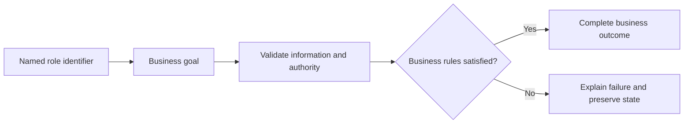

# Tour Management Use Cases

## Personas

| Persona | Role | Responsibility |
|---|---|---|
| Customer X | Visitor | Participates in authorized scenarios for this module. |
| Employee X | Employee | Participates in authorized scenarios for this module. |
| Agency Owner X | Agency Owner | Participates in authorized scenarios for this module. |
| Customer Y | Customer | Participates in authorized scenarios for this module. |

## Use-case catalog

| ID | Name | Primary actor | Business outcome |
|---|---|---|---|
| UC-1 | Browse currently bookable tours | Customer X - Visitor | The requested business outcome is completed and visible to the authorized actor. |
| UC-2 | Search operational tours | Employee X - Employee | The requested business outcome is completed and visible to the authorized actor. |
| UC-3 | List tours with bounded pagination | Employee X - Employee | The requested business outcome is completed and visible to the authorized actor. |
| UC-4 | View one tour | Employee X - Employee | The requested business outcome is completed and visible to the authorized actor. |
| UC-5 | Create and validate a tour | Employee X - Employee | The requested business outcome is completed and visible to the authorized actor. |
| UC-6 | Update editable tour details | Employee X - Employee | The requested business outcome is completed and visible to the authorized actor. |
| UC-7 | Execute a tour workflow transition | Employee X - Employee | The requested business outcome is completed and visible to the authorized actor. |
| UC-8 | Register a unit and generate its seats | Agency Owner X - Agency Owner | The requested business outcome is completed and visible to the authorized actor. |
| UC-9 | Import multiple transport units server-side | Agency Owner X - Agency Owner | The requested business outcome is completed and visible to the authorized actor. |
| UC-10 | List transport units | Agency Owner X - Agency Owner | The requested business outcome is completed and visible to the authorized actor. |
| UC-11 | View a unit with seat details | Agency Owner X - Agency Owner | The requested business outcome is completed and visible to the authorized actor. |
| UC-12 | Update scalar fields or safe seat layout | Agency Owner X - Agency Owner | The requested business outcome is completed and visible to the authorized actor. |
| UC-13 | Change operational unit status | Agency Owner X - Agency Owner | The requested business outcome is completed and visible to the authorized actor. |
| UC-14 | Search the fleet using server filters | Agency Owner X - Agency Owner | The requested business outcome is completed and visible to the authorized actor. |
| UC-15 | List seats with pagination | Employee X - Employee | The requested business outcome is completed and visible to the authorized actor. |
| UC-16 | View one seat | Employee X - Employee | The requested business outcome is completed and visible to the authorized actor. |
| UC-17 | Configure an editable seat | Employee X - Employee | The requested business outcome is completed and visible to the authorized actor. |
| UC-18 | Filter seats by unit, class, status, or code | Employee X - Employee | The requested business outcome is completed and visible to the authorized actor. |
| UC-19 | Change operational seat status | Employee X - Employee | The requested business outcome is completed and visible to the authorized actor. |
| UC-20 | List meal plans | Agency Owner X - Agency Owner | The requested business outcome is completed and visible to the authorized actor. |
| UC-21 | Show an agency meal catalog | Agency Owner X - Agency Owner | The requested business outcome is completed and visible to the authorized actor. |
| UC-22 | Define a meal offering | Agency Owner X - Agency Owner | The requested business outcome is completed and visible to the authorized actor. |
| UC-23 | Enable or disable a meal | Agency Owner X - Agency Owner | The requested business outcome is completed and visible to the authorized actor. |
| UC-24 | Update meal pricing | Agency Owner X - Agency Owner | The requested business outcome is completed and visible to the authorized actor. |
| UC-25 | Create a 15-minute booking hold | Customer Y - Customer | The requested business outcome is completed and visible to the authorized actor. |
| UC-26 | Perform an authorized reservation transition | Customer Y - Customer | The requested business outcome is completed and visible to the authorized actor. |
| UC-27 | Cancel, refund when eligible, and release inventory | Customer Y - Customer | The requested business outcome is completed and visible to the authorized actor. |
| UC-28 | Search reservations with role scoping | Customer Y - Customer | The requested business outcome is completed and visible to the authorized actor. |
| UC-29 | List role-scoped reservations | Customer Y - Customer | The requested business outcome is completed and visible to the authorized actor. |
| UC-30 | View one authorized reservation | Customer Y - Customer | The requested business outcome is completed and visible to the authorized actor. |
| UC-31 | Search role-scoped tickets | Customer Y - Customer | The requested business outcome is completed and visible to the authorized actor. |
| UC-32 | List role-scoped tickets | Customer Y - Customer | The requested business outcome is completed and visible to the authorized actor. |
| UC-33 | View one authorized ticket | Customer Y - Customer | The requested business outcome is completed and visible to the authorized actor. |
| UC-34 | Create a ticket and generate codes | Customer Y - Customer | The requested business outcome is completed and visible to the authorized actor. |
| UC-35 | Execute a ticket approval transition | Customer Y - Customer | The requested business outcome is completed and visible to the authorized actor. |
| UC-36 | Cancel a ticket and release its inventory | Customer Y - Customer | The requested business outcome is completed and visible to the authorized actor. |
| UC-37 | Approve a paid ticket | Customer Y - Customer | The requested business outcome is completed and visible to the authorized actor. |
| UC-38 | Confirm an approved ticket | Customer Y - Customer | The requested business outcome is completed and visible to the authorized actor. |

## UC-1: Browse currently bookable tours

### Description

This use case describes the business scenario for browse currently bookable tours. It explains the actor's objective, required business conditions, governing rules, expected outcome, and failure behavior. The description remains focused on business behavior and outcomes.

### Actor, preconditions, and trigger

- **Primary actor:** Customer X - Visitor
- **Preconditions:** dependencies are available; access is authorized; Geography/date filters and pagination is valid; referenced records exist.
- **Trigger:** Customer X chooses to browse currently bookable tours.

### Main success flow

1. The actor starts the business action.
2. The system validates the supplied business information.
3. Role, ownership, availability, and workflow rules are evaluated.
4. The requested business operation is completed.
5. Related business records remain consistent.
6. The outcome is shown to the authorized actor.

### Business rules

- Data is scoped to the authorized actor and feature boundary.

### Alternative and exception flows

1. Invalid input returns field feedback without mutation.
2. Unauthorized ownership returns access denied without protected data.
3. Missing records return the standard not-found response.
4. Workflow, concurrency, or dependency failure rolls back and returns a safe message.

### Postconditions

- **Success:** The requested business outcome is completed and visible to the authorized actor.
- **Failure:** no invalid, duplicate, unauthorized, or partial state remains.

### Case study

- **Scenario:** Emma manages the Bahrain Cultural Escape tour.
- **Example data:** Future dates; capacity 30; valid transport; BHD 79.
- **Expected outcome:** The operation completes under date, capacity, conflict, and lifecycle rules.
- **Failure example:** Invalid dates, conflicts, or transitions preserve prior state.
- **Business value:** Confirms realistic behavior, traceability, and data consistency.

---

## UC-2: Search operational tours

### Description

This use case describes the business scenario for search operational tours. It explains the actor's objective, required business conditions, governing rules, expected outcome, and failure behavior. The description remains focused on business behavior and outcomes.

### Actor, preconditions, and trigger

- **Primary actor:** Employee X - Employee
- **Preconditions:** dependencies are available; access is authorized; `TourFilterRequest` is valid; referenced records exist.
- **Trigger:** Employee X chooses to search operational tours.

### Main success flow

1. The actor starts the business action.
2. The system validates the supplied business information.
3. Role, ownership, availability, and workflow rules are evaluated.
4. The requested business operation is completed.
5. Related business records remain consistent.
6. The outcome is shown to the authorized actor.

### Business rules

- Data is scoped to the authorized actor and feature boundary.

### Alternative and exception flows

1. Invalid input returns field feedback without mutation.
2. Unauthorized ownership returns access denied without protected data.
3. Missing records return the standard not-found response.
4. Workflow, concurrency, or dependency failure rolls back and returns a safe message.

### Postconditions

- **Success:** The requested business outcome is completed and visible to the authorized actor.
- **Failure:** no invalid, duplicate, unauthorized, or partial state remains.

### Case study

- **Scenario:** Emma manages the Bahrain Cultural Escape tour.
- **Example data:** Future dates; capacity 30; valid transport; BHD 79.
- **Expected outcome:** The operation completes under date, capacity, conflict, and lifecycle rules.
- **Failure example:** Invalid dates, conflicts, or transitions preserve prior state.
- **Business value:** Confirms realistic behavior, traceability, and data consistency.

---

## UC-3: List tours with bounded pagination

### Description

This use case describes the business scenario for list tours with bounded pagination. It explains the actor's objective, required business conditions, governing rules, expected outcome, and failure behavior. The description remains focused on business behavior and outcomes.

### Actor, preconditions, and trigger

- **Primary actor:** Employee X - Employee
- **Preconditions:** dependencies are available; access is authorized; Page, size, sort is valid; referenced records exist.
- **Trigger:** Employee X chooses to list tours with bounded pagination.

### Main success flow

1. The actor starts the business action.
2. The system validates the supplied business information.
3. Role, ownership, availability, and workflow rules are evaluated.
4. The requested business operation is completed.
5. Related business records remain consistent.
6. The outcome is shown to the authorized actor.

### Business rules

- Data is scoped to the authorized actor and feature boundary.

### Alternative and exception flows

1. Invalid input returns field feedback without mutation.
2. Unauthorized ownership returns access denied without protected data.
3. Missing records return the standard not-found response.
4. Workflow, concurrency, or dependency failure rolls back and returns a safe message.

### Postconditions

- **Success:** The requested business outcome is completed and visible to the authorized actor.
- **Failure:** no invalid, duplicate, unauthorized, or partial state remains.

### Case study

- **Scenario:** Emma manages the Bahrain Cultural Escape tour.
- **Example data:** Future dates; capacity 30; valid transport; BHD 79.
- **Expected outcome:** The operation completes under date, capacity, conflict, and lifecycle rules.
- **Failure example:** Invalid dates, conflicts, or transitions preserve prior state.
- **Business value:** Confirms realistic behavior, traceability, and data consistency.

---

## UC-4: View one tour

### Description

This use case describes the business scenario for view one tour. It explains the actor's objective, required business conditions, governing rules, expected outcome, and failure behavior. The description remains focused on business behavior and outcomes.

### Actor, preconditions, and trigger

- **Primary actor:** Employee X - Employee
- **Preconditions:** dependencies are available; access is authorized; Tour ID is valid; referenced records exist.
- **Trigger:** Employee X chooses to view one tour.

### Main success flow

1. The actor starts the business action.
2. The system validates the supplied business information.
3. Role, ownership, availability, and workflow rules are evaluated.
4. The requested business operation is completed.
5. Related business records remain consistent.
6. The outcome is shown to the authorized actor.

### Business rules

- Data is scoped to the authorized actor and feature boundary.

### Alternative and exception flows

1. Invalid input returns field feedback without mutation.
2. Unauthorized ownership returns access denied without protected data.
3. Missing records return the standard not-found response.
4. Workflow, concurrency, or dependency failure rolls back and returns a safe message.

### Postconditions

- **Success:** The requested business outcome is completed and visible to the authorized actor.
- **Failure:** no invalid, duplicate, unauthorized, or partial state remains.

### Case study

- **Scenario:** Emma manages the Bahrain Cultural Escape tour.
- **Example data:** Future dates; capacity 30; valid transport; BHD 79.
- **Expected outcome:** The operation completes under date, capacity, conflict, and lifecycle rules.
- **Failure example:** Invalid dates, conflicts, or transitions preserve prior state.
- **Business value:** Confirms realistic behavior, traceability, and data consistency.

---

## UC-5: Create and validate a tour

### Description

This use case describes the business scenario for create and validate a tour. It explains the actor's objective, required business conditions, governing rules, expected outcome, and failure behavior. The description remains focused on business behavior and outcomes.

### Actor, preconditions, and trigger

- **Primary actor:** Employee X - Employee
- **Preconditions:** dependencies are available; access is authorized; Validated `Tour` is valid; referenced records exist.
- **Trigger:** Employee X chooses to create and validate a tour.

### Main success flow

1. The actor starts the business action.
2. The system validates the supplied business information.
3. Role, ownership, availability, and workflow rules are evaluated.
4. The requested business operation is completed.
5. Related business records remain consistent.
6. The outcome is shown to the authorized actor.

### Business rules

- Role, ownership, and workflow state are verified before mutation.

### Alternative and exception flows

1. Invalid input returns field feedback without mutation.
2. Unauthorized ownership returns access denied without protected data.
3. Missing records return the standard not-found response.
4. Workflow, concurrency, or dependency failure rolls back and returns a safe message.

### Postconditions

- **Success:** The requested business outcome is completed and visible to the authorized actor.
- **Failure:** no invalid, duplicate, unauthorized, or partial state remains.

### Case study

- **Scenario:** Emma manages the Bahrain Cultural Escape tour.
- **Example data:** Future dates; capacity 30; valid transport; BHD 79.
- **Expected outcome:** The operation completes under date, capacity, conflict, and lifecycle rules.
- **Failure example:** Invalid dates, conflicts, or transitions preserve prior state.
- **Business value:** Confirms realistic behavior, traceability, and data consistency.

---

## UC-6: Update editable tour details

### Description

This use case describes the business scenario for update editable tour details. It explains the actor's objective, required business conditions, governing rules, expected outcome, and failure behavior. The description remains focused on business behavior and outcomes.

### Actor, preconditions, and trigger

- **Primary actor:** Employee X - Employee
- **Preconditions:** dependencies are available; access is authorized; Tour ID and validated `Tour` is valid; referenced records exist.
- **Trigger:** Employee X chooses to update editable tour details.

### Main success flow

1. The actor starts the business action.
2. The system validates the supplied business information.
3. Role, ownership, availability, and workflow rules are evaluated.
4. The requested business operation is completed.
5. Related business records remain consistent.
6. The outcome is shown to the authorized actor.

### Business rules

- Role, ownership, and workflow state are verified before mutation.

### Alternative and exception flows

1. Invalid input returns field feedback without mutation.
2. Unauthorized ownership returns access denied without protected data.
3. Missing records return the standard not-found response.
4. Workflow, concurrency, or dependency failure rolls back and returns a safe message.

### Postconditions

- **Success:** The requested business outcome is completed and visible to the authorized actor.
- **Failure:** no invalid, duplicate, unauthorized, or partial state remains.

### Case study

- **Scenario:** Emma manages the Bahrain Cultural Escape tour.
- **Example data:** Future dates; capacity 30; valid transport; BHD 79.
- **Expected outcome:** The operation completes under date, capacity, conflict, and lifecycle rules.
- **Failure example:** Invalid dates, conflicts, or transitions preserve prior state.
- **Business value:** Confirms realistic behavior, traceability, and data consistency.

---

## UC-7: Execute a tour workflow transition

### Description

This use case describes the business scenario for execute a tour workflow transition. It explains the actor's objective, required business conditions, governing rules, expected outcome, and failure behavior. The description remains focused on business behavior and outcomes.

### Actor, preconditions, and trigger

- **Primary actor:** Employee X - Employee
- **Preconditions:** dependencies are available; access is authorized; Tour ID and status is valid; referenced records exist.
- **Trigger:** Employee X chooses to execute a tour workflow transition.

### Main success flow

1. The actor starts the business action.
2. The system validates the supplied business information.
3. Role, ownership, availability, and workflow rules are evaluated.
4. The requested business operation is completed.
5. Related business records remain consistent.
6. The outcome is shown to the authorized actor.

### Business rules

- Role, ownership, and workflow state are verified before mutation.

### Alternative and exception flows

1. Invalid input returns field feedback without mutation.
2. Unauthorized ownership returns access denied without protected data.
3. Missing records return the standard not-found response.
4. Workflow, concurrency, or dependency failure rolls back and returns a safe message.

### Postconditions

- **Success:** The requested business outcome is completed and visible to the authorized actor.
- **Failure:** no invalid, duplicate, unauthorized, or partial state remains.

### Case study

- **Scenario:** Emma manages the Bahrain Cultural Escape tour.
- **Example data:** Future dates; capacity 30; valid transport; BHD 79.
- **Expected outcome:** The operation completes under date, capacity, conflict, and lifecycle rules.
- **Failure example:** Invalid dates, conflicts, or transitions preserve prior state.
- **Business value:** Confirms realistic behavior, traceability, and data consistency.

---

## UC-8: Register a unit and generate its seats

### Description

This use case describes the business scenario for register a unit and generate its seats. It explains the actor's objective, required business conditions, governing rules, expected outcome, and failure behavior. The description remains focused on business behavior and outcomes.

### Actor, preconditions, and trigger

- **Primary actor:** Agency Owner X - Agency Owner
- **Preconditions:** dependencies are available; access is authorized; `TransportationCreateRequest` is valid; referenced records exist.
- **Trigger:** Agency Owner X chooses to register a unit and generate its seats.

### Main success flow

1. The actor starts the business action.
2. The system validates the supplied business information.
3. Role, ownership, availability, and workflow rules are evaluated.
4. The requested business operation is completed.
5. Related business records remain consistent.
6. The outcome is shown to the authorized actor.

### Business rules

- Role, ownership, and workflow state are verified before mutation.
- Capacity/layout changes cannot bypass active booking protections.

### Alternative and exception flows

1. Invalid input returns field feedback without mutation.
2. Unauthorized ownership returns access denied without protected data.
3. Missing records return the standard not-found response.
4. Workflow, concurrency, or dependency failure rolls back and returns a safe message.

### Postconditions

- **Success:** The requested business outcome is completed and visible to the authorized actor.
- **Failure:** no invalid, duplicate, unauthorized, or partial state remains.

### Case study

- **Scenario:** Omar registers flight FAP580000BHD for Al Aradi Travel.
- **Example data:** Capacity 50; 10 kids; 10 premium; remainder standard.
- **Expected outcome:** Exactly 50 owned seats are generated.
- **Failure example:** Duplicate code, wrong branch, or excess layout is rejected.
- **Business value:** Confirms realistic behavior, traceability, and data consistency.

---

## UC-9: Import multiple transport units server-side

### Description

This use case describes the business scenario for import multiple transport units server-side. It explains the actor's objective, required business conditions, governing rules, expected outcome, and failure behavior. The description remains focused on business behavior and outcomes.

### Actor, preconditions, and trigger

- **Primary actor:** Agency Owner X - Agency Owner
- **Preconditions:** dependencies are available; access is authorized; Multipart Excel file is valid; referenced records exist.
- **Trigger:** Agency Owner X chooses to import multiple transport units server-side.

### Main success flow

1. The actor starts the business action.
2. The system validates the supplied business information.
3. Role, ownership, availability, and workflow rules are evaluated.
4. The requested business operation is completed.
5. Related business records remain consistent.
6. The outcome is shown to the authorized actor.

### Business rules

- Role, ownership, and workflow state are verified before mutation.
- Capacity/layout changes cannot bypass active booking protections.

### Alternative and exception flows

1. Invalid input returns field feedback without mutation.
2. Unauthorized ownership returns access denied without protected data.
3. Missing records return the standard not-found response.
4. Workflow, concurrency, or dependency failure rolls back and returns a safe message.

### Postconditions

- **Success:** The requested business outcome is completed and visible to the authorized actor.
- **Failure:** no invalid, duplicate, unauthorized, or partial state remains.

### Case study

- **Scenario:** Omar registers flight FAP580000BHD for Al Aradi Travel.
- **Example data:** Capacity 50; 10 kids; 10 premium; remainder standard.
- **Expected outcome:** Exactly 50 owned seats are generated.
- **Failure example:** Duplicate code, wrong branch, or excess layout is rejected.
- **Business value:** Confirms realistic behavior, traceability, and data consistency.

---

## UC-10: List transport units

### Description

This use case describes the business scenario for list transport units. It explains the actor's objective, required business conditions, governing rules, expected outcome, and failure behavior. The description remains focused on business behavior and outcomes.

### Actor, preconditions, and trigger

- **Primary actor:** Agency Owner X - Agency Owner
- **Preconditions:** dependencies are available; access is authorized; Page, size, sort is valid; referenced records exist.
- **Trigger:** Agency Owner X chooses to list transport units.

### Main success flow

1. The actor starts the business action.
2. The system validates the supplied business information.
3. Role, ownership, availability, and workflow rules are evaluated.
4. The requested business operation is completed.
5. Related business records remain consistent.
6. The outcome is shown to the authorized actor.

### Business rules

- Data is scoped to the authorized actor and feature boundary.
- Capacity/layout changes cannot bypass active booking protections.

### Alternative and exception flows

1. Invalid input returns field feedback without mutation.
2. Unauthorized ownership returns access denied without protected data.
3. Missing records return the standard not-found response.
4. Workflow, concurrency, or dependency failure rolls back and returns a safe message.

### Postconditions

- **Success:** The requested business outcome is completed and visible to the authorized actor.
- **Failure:** no invalid, duplicate, unauthorized, or partial state remains.

### Case study

- **Scenario:** Omar registers flight FAP580000BHD for Al Aradi Travel.
- **Example data:** Capacity 50; 10 kids; 10 premium; remainder standard.
- **Expected outcome:** Exactly 50 owned seats are generated.
- **Failure example:** Duplicate code, wrong branch, or excess layout is rejected.
- **Business value:** Confirms realistic behavior, traceability, and data consistency.

---

## UC-11: View a unit with seat details

### Description

This use case describes the business scenario for view a unit with seat details. It explains the actor's objective, required business conditions, governing rules, expected outcome, and failure behavior. The description remains focused on business behavior and outcomes.

### Actor, preconditions, and trigger

- **Primary actor:** Agency Owner X - Agency Owner
- **Preconditions:** dependencies are available; access is authorized; Transportation ID is valid; referenced records exist.
- **Trigger:** Agency Owner X chooses to view a unit with seat details.

### Main success flow

1. The actor starts the business action.
2. The system validates the supplied business information.
3. Role, ownership, availability, and workflow rules are evaluated.
4. The requested business operation is completed.
5. Related business records remain consistent.
6. The outcome is shown to the authorized actor.

### Business rules

- Data is scoped to the authorized actor and feature boundary.
- Capacity/layout changes cannot bypass active booking protections.

### Alternative and exception flows

1. Invalid input returns field feedback without mutation.
2. Unauthorized ownership returns access denied without protected data.
3. Missing records return the standard not-found response.
4. Workflow, concurrency, or dependency failure rolls back and returns a safe message.

### Postconditions

- **Success:** The requested business outcome is completed and visible to the authorized actor.
- **Failure:** no invalid, duplicate, unauthorized, or partial state remains.

### Case study

- **Scenario:** Omar registers flight FAP580000BHD for Al Aradi Travel.
- **Example data:** Capacity 50; 10 kids; 10 premium; remainder standard.
- **Expected outcome:** Exactly 50 owned seats are generated.
- **Failure example:** Duplicate code, wrong branch, or excess layout is rejected.
- **Business value:** Confirms realistic behavior, traceability, and data consistency.

---

## UC-12: Update scalar fields or safe seat layout

### Description

This use case describes the business scenario for update scalar fields or safe seat layout. It explains the actor's objective, required business conditions, governing rules, expected outcome, and failure behavior. The description remains focused on business behavior and outcomes.

### Actor, preconditions, and trigger

- **Primary actor:** Agency Owner X - Agency Owner
- **Preconditions:** dependencies are available; access is authorized; ID and `Transportation` is valid; referenced records exist.
- **Trigger:** Agency Owner X chooses to update scalar fields or safe seat layout.

### Main success flow

1. The actor starts the business action.
2. The system validates the supplied business information.
3. Role, ownership, availability, and workflow rules are evaluated.
4. The requested business operation is completed.
5. Related business records remain consistent.
6. The outcome is shown to the authorized actor.

### Business rules

- Role, ownership, and workflow state are verified before mutation.
- Capacity/layout changes cannot bypass active booking protections.

### Alternative and exception flows

1. Invalid input returns field feedback without mutation.
2. Unauthorized ownership returns access denied without protected data.
3. Missing records return the standard not-found response.
4. Workflow, concurrency, or dependency failure rolls back and returns a safe message.

### Postconditions

- **Success:** The requested business outcome is completed and visible to the authorized actor.
- **Failure:** no invalid, duplicate, unauthorized, or partial state remains.

### Case study

- **Scenario:** Omar registers flight FAP580000BHD for Al Aradi Travel.
- **Example data:** Capacity 50; 10 kids; 10 premium; remainder standard.
- **Expected outcome:** Exactly 50 owned seats are generated.
- **Failure example:** Duplicate code, wrong branch, or excess layout is rejected.
- **Business value:** Confirms realistic behavior, traceability, and data consistency.

---

## UC-13: Change operational unit status

### Description

This use case describes the business scenario for change operational unit status. It explains the actor's objective, required business conditions, governing rules, expected outcome, and failure behavior. The description remains focused on business behavior and outcomes.

### Actor, preconditions, and trigger

- **Primary actor:** Agency Owner X - Agency Owner
- **Preconditions:** dependencies are available; access is authorized; ID and `TransportationStatus` is valid; referenced records exist.
- **Trigger:** Agency Owner X chooses to change operational unit status.

### Main success flow

1. The actor starts the business action.
2. The system validates the supplied business information.
3. Role, ownership, availability, and workflow rules are evaluated.
4. The requested business operation is completed.
5. Related business records remain consistent.
6. The outcome is shown to the authorized actor.

### Business rules

- Role, ownership, and workflow state are verified before mutation.
- Capacity/layout changes cannot bypass active booking protections.

### Alternative and exception flows

1. Invalid input returns field feedback without mutation.
2. Unauthorized ownership returns access denied without protected data.
3. Missing records return the standard not-found response.
4. Workflow, concurrency, or dependency failure rolls back and returns a safe message.

### Postconditions

- **Success:** The requested business outcome is completed and visible to the authorized actor.
- **Failure:** no invalid, duplicate, unauthorized, or partial state remains.

### Case study

- **Scenario:** Omar registers flight FAP580000BHD for Al Aradi Travel.
- **Example data:** Capacity 50; 10 kids; 10 premium; remainder standard.
- **Expected outcome:** Exactly 50 owned seats are generated.
- **Failure example:** Duplicate code, wrong branch, or excess layout is rejected.
- **Business value:** Confirms realistic behavior, traceability, and data consistency.

---

## UC-14: Search the fleet using server filters

### Description

This use case describes the business scenario for search the fleet using server filters. It explains the actor's objective, required business conditions, governing rules, expected outcome, and failure behavior. The description remains focused on business behavior and outcomes.

### Actor, preconditions, and trigger

- **Primary actor:** Agency Owner X - Agency Owner
- **Preconditions:** dependencies are available; access is authorized; `TransportationFilterRequest` is valid; referenced records exist.
- **Trigger:** Agency Owner X chooses to search the fleet using server filters.

### Main success flow

1. The actor starts the business action.
2. The system validates the supplied business information.
3. Role, ownership, availability, and workflow rules are evaluated.
4. The requested business operation is completed.
5. Related business records remain consistent.
6. The outcome is shown to the authorized actor.

### Business rules

- Data is scoped to the authorized actor and feature boundary.
- Capacity/layout changes cannot bypass active booking protections.

### Alternative and exception flows

1. Invalid input returns field feedback without mutation.
2. Unauthorized ownership returns access denied without protected data.
3. Missing records return the standard not-found response.
4. Workflow, concurrency, or dependency failure rolls back and returns a safe message.

### Postconditions

- **Success:** The requested business outcome is completed and visible to the authorized actor.
- **Failure:** no invalid, duplicate, unauthorized, or partial state remains.

### Case study

- **Scenario:** Omar registers flight FAP580000BHD for Al Aradi Travel.
- **Example data:** Capacity 50; 10 kids; 10 premium; remainder standard.
- **Expected outcome:** Exactly 50 owned seats are generated.
- **Failure example:** Duplicate code, wrong branch, or excess layout is rejected.
- **Business value:** Confirms realistic behavior, traceability, and data consistency.

---

## UC-15: List seats with pagination

### Description

This use case describes the business scenario for list seats with pagination. It explains the actor's objective, required business conditions, governing rules, expected outcome, and failure behavior. The description remains focused on business behavior and outcomes.

### Actor, preconditions, and trigger

- **Primary actor:** Employee X - Employee
- **Preconditions:** dependencies are available; access is authorized; Page, size, direction is valid; referenced records exist.
- **Trigger:** Employee X chooses to list seats with pagination.

### Main success flow

1. The actor starts the business action.
2. The system validates the supplied business information.
3. Role, ownership, availability, and workflow rules are evaluated.
4. The requested business operation is completed.
5. Related business records remain consistent.
6. The outcome is shown to the authorized actor.

### Business rules

- Data is scoped to the authorized actor and feature boundary.
- Capacity/layout changes cannot bypass active booking protections.

### Alternative and exception flows

1. Invalid input returns field feedback without mutation.
2. Unauthorized ownership returns access denied without protected data.
3. Missing records return the standard not-found response.
4. Workflow, concurrency, or dependency failure rolls back and returns a safe message.

### Postconditions

- **Success:** The requested business outcome is completed and visible to the authorized actor.
- **Failure:** no invalid, duplicate, unauthorized, or partial state remains.

### Case study

- **Scenario:** Emma configures seat S9 before active tour assignment.
- **Example data:** S9; KIDS_CHAIR; BHD 0 modifier.
- **Expected outcome:** The classification updates in seat management.
- **Failure example:** Booked, reserved, or locked seats remain unchanged.
- **Business value:** Confirms realistic behavior, traceability, and data consistency.

---

## UC-16: View one seat

### Description

This use case describes the business scenario for view one seat. It explains the actor's objective, required business conditions, governing rules, expected outcome, and failure behavior. The description remains focused on business behavior and outcomes.

### Actor, preconditions, and trigger

- **Primary actor:** Employee X - Employee
- **Preconditions:** dependencies are available; access is authorized; Seat ID is valid; referenced records exist.
- **Trigger:** Employee X chooses to view one seat.

### Main success flow

1. The actor starts the business action.
2. The system validates the supplied business information.
3. Role, ownership, availability, and workflow rules are evaluated.
4. The requested business operation is completed.
5. Related business records remain consistent.
6. The outcome is shown to the authorized actor.

### Business rules

- Data is scoped to the authorized actor and feature boundary.
- Capacity/layout changes cannot bypass active booking protections.

### Alternative and exception flows

1. Invalid input returns field feedback without mutation.
2. Unauthorized ownership returns access denied without protected data.
3. Missing records return the standard not-found response.
4. Workflow, concurrency, or dependency failure rolls back and returns a safe message.

### Postconditions

- **Success:** The requested business outcome is completed and visible to the authorized actor.
- **Failure:** no invalid, duplicate, unauthorized, or partial state remains.

### Case study

- **Scenario:** Emma configures seat S9 before active tour assignment.
- **Example data:** S9; KIDS_CHAIR; BHD 0 modifier.
- **Expected outcome:** The classification updates in seat management.
- **Failure example:** Booked, reserved, or locked seats remain unchanged.
- **Business value:** Confirms realistic behavior, traceability, and data consistency.

---

## UC-17: Configure an editable seat

### Description

This use case describes the business scenario for configure an editable seat. It explains the actor's objective, required business conditions, governing rules, expected outcome, and failure behavior. The description remains focused on business behavior and outcomes.

### Actor, preconditions, and trigger

- **Primary actor:** Employee X - Employee
- **Preconditions:** dependencies are available; access is authorized; Seat ID and validated seat body is valid; referenced records exist.
- **Trigger:** Employee X chooses to configure an editable seat.

### Main success flow

1. The actor starts the business action.
2. The system validates the supplied business information.
3. Role, ownership, availability, and workflow rules are evaluated.
4. The requested business operation is completed.
5. Related business records remain consistent.
6. The outcome is shown to the authorized actor.

### Business rules

- Role, ownership, and workflow state are verified before mutation.
- Capacity/layout changes cannot bypass active booking protections.

### Alternative and exception flows

1. Invalid input returns field feedback without mutation.
2. Unauthorized ownership returns access denied without protected data.
3. Missing records return the standard not-found response.
4. Workflow, concurrency, or dependency failure rolls back and returns a safe message.

### Postconditions

- **Success:** The requested business outcome is completed and visible to the authorized actor.
- **Failure:** no invalid, duplicate, unauthorized, or partial state remains.

### Case study

- **Scenario:** Emma configures seat S9 before active tour assignment.
- **Example data:** S9; KIDS_CHAIR; BHD 0 modifier.
- **Expected outcome:** The classification updates in seat management.
- **Failure example:** Booked, reserved, or locked seats remain unchanged.
- **Business value:** Confirms realistic behavior, traceability, and data consistency.

---

## UC-18: Filter seats by unit, class, status, or code

### Description

This use case describes the business scenario for filter seats by unit, class, status, or code. It explains the actor's objective, required business conditions, governing rules, expected outcome, and failure behavior. The description remains focused on business behavior and outcomes.

### Actor, preconditions, and trigger

- **Primary actor:** Employee X - Employee
- **Preconditions:** dependencies are available; access is authorized; `SeatFilterRequest` is valid; referenced records exist.
- **Trigger:** Employee X chooses to filter seats by unit, class, status, or code.

### Main success flow

1. The actor starts the business action.
2. The system validates the supplied business information.
3. Role, ownership, availability, and workflow rules are evaluated.
4. The requested business operation is completed.
5. Related business records remain consistent.
6. The outcome is shown to the authorized actor.

### Business rules

- Data is scoped to the authorized actor and feature boundary.
- Capacity/layout changes cannot bypass active booking protections.

### Alternative and exception flows

1. Invalid input returns field feedback without mutation.
2. Unauthorized ownership returns access denied without protected data.
3. Missing records return the standard not-found response.
4. Workflow, concurrency, or dependency failure rolls back and returns a safe message.

### Postconditions

- **Success:** The requested business outcome is completed and visible to the authorized actor.
- **Failure:** no invalid, duplicate, unauthorized, or partial state remains.

### Case study

- **Scenario:** Emma configures seat S9 before active tour assignment.
- **Example data:** S9; KIDS_CHAIR; BHD 0 modifier.
- **Expected outcome:** The classification updates in seat management.
- **Failure example:** Booked, reserved, or locked seats remain unchanged.
- **Business value:** Confirms realistic behavior, traceability, and data consistency.

---

## UC-19: Change operational seat status

### Description

This use case describes the business scenario for change operational seat status. It explains the actor's objective, required business conditions, governing rules, expected outcome, and failure behavior. The description remains focused on business behavior and outcomes.

### Actor, preconditions, and trigger

- **Primary actor:** Employee X - Employee
- **Preconditions:** dependencies are available; access is authorized; Seat ID and `SeatStatus` is valid; referenced records exist.
- **Trigger:** Employee X chooses to change operational seat status.

### Main success flow

1. The actor starts the business action.
2. The system validates the supplied business information.
3. Role, ownership, availability, and workflow rules are evaluated.
4. The requested business operation is completed.
5. Related business records remain consistent.
6. The outcome is shown to the authorized actor.

### Business rules

- Role, ownership, and workflow state are verified before mutation.
- Capacity/layout changes cannot bypass active booking protections.

### Alternative and exception flows

1. Invalid input returns field feedback without mutation.
2. Unauthorized ownership returns access denied without protected data.
3. Missing records return the standard not-found response.
4. Workflow, concurrency, or dependency failure rolls back and returns a safe message.

### Postconditions

- **Success:** The requested business outcome is completed and visible to the authorized actor.
- **Failure:** no invalid, duplicate, unauthorized, or partial state remains.

### Case study

- **Scenario:** Emma configures seat S9 before active tour assignment.
- **Example data:** S9; KIDS_CHAIR; BHD 0 modifier.
- **Expected outcome:** The classification updates in seat management.
- **Failure example:** Booked, reserved, or locked seats remain unchanged.
- **Business value:** Confirms realistic behavior, traceability, and data consistency.

---

## UC-20: List meal plans

### Description

This use case describes the business scenario for list meal plans. It explains the actor's objective, required business conditions, governing rules, expected outcome, and failure behavior. The description remains focused on business behavior and outcomes.

### Actor, preconditions, and trigger

- **Primary actor:** Agency Owner X - Agency Owner
- **Preconditions:** dependencies are available; access is authorized; Page, size, direction is valid; referenced records exist.
- **Trigger:** Agency Owner X chooses to list meal plans.

### Main success flow

1. The actor starts the business action.
2. The system validates the supplied business information.
3. Role, ownership, availability, and workflow rules are evaluated.
4. The requested business operation is completed.
5. Related business records remain consistent.
6. The outcome is shown to the authorized actor.

### Business rules

- Data is scoped to the authorized actor and feature boundary.

### Alternative and exception flows

1. Invalid input returns field feedback without mutation.
2. Unauthorized ownership returns access denied without protected data.
3. Missing records return the standard not-found response.
4. Workflow, concurrency, or dependency failure rolls back and returns a safe message.

### Postconditions

- **Success:** The requested business outcome is completed and visible to the authorized actor.
- **Failure:** no invalid, duplicate, unauthorized, or partial state remains.

### Case study

- **Scenario:** The actor performs list meal plans with realistic feature data.
- **Example data:** Representative feature data that satisfies the stated preconditions.
- **Expected outcome:** Authorized state is returned or committed and displayed.
- **Failure example:** Invalid input or dependency failure leaves no partial state.
- **Business value:** Confirms realistic behavior, traceability, and data consistency.

---

## UC-21: Show an agency meal catalog

### Description

This use case describes the business scenario for show an agency meal catalog. It explains the actor's objective, required business conditions, governing rules, expected outcome, and failure behavior. The description remains focused on business behavior and outcomes.

### Actor, preconditions, and trigger

- **Primary actor:** Agency Owner X - Agency Owner
- **Preconditions:** dependencies are available; access is authorized; Agency ID and pagination is valid; referenced records exist.
- **Trigger:** Agency Owner X chooses to show an agency meal catalog.

### Main success flow

1. The actor starts the business action.
2. The system validates the supplied business information.
3. Role, ownership, availability, and workflow rules are evaluated.
4. The requested business operation is completed.
5. Related business records remain consistent.
6. The outcome is shown to the authorized actor.

### Business rules

- Data is scoped to the authorized actor and feature boundary.

### Alternative and exception flows

1. Invalid input returns field feedback without mutation.
2. Unauthorized ownership returns access denied without protected data.
3. Missing records return the standard not-found response.
4. Workflow, concurrency, or dependency failure rolls back and returns a safe message.

### Postconditions

- **Success:** The requested business outcome is completed and visible to the authorized actor.
- **Failure:** no invalid, duplicate, unauthorized, or partial state remains.

### Case study

- **Scenario:** The actor performs show an agency meal catalog with realistic feature data.
- **Example data:** Representative feature data that satisfies the stated preconditions.
- **Expected outcome:** Authorized state is returned or committed and displayed.
- **Failure example:** Invalid input or dependency failure leaves no partial state.
- **Business value:** Confirms realistic behavior, traceability, and data consistency.

---

## UC-22: Define a meal offering

### Description

This use case describes the business scenario for define a meal offering. It explains the actor's objective, required business conditions, governing rules, expected outcome, and failure behavior. The description remains focused on business behavior and outcomes.

### Actor, preconditions, and trigger

- **Primary actor:** Agency Owner X - Agency Owner
- **Preconditions:** dependencies are available; access is authorized; Validated `MealPlan` is valid; referenced records exist.
- **Trigger:** Agency Owner X chooses to define a meal offering.

### Main success flow

1. The actor starts the business action.
2. The system validates the supplied business information.
3. Role, ownership, availability, and workflow rules are evaluated.
4. The requested business operation is completed.
5. Related business records remain consistent.
6. The outcome is shown to the authorized actor.

### Business rules

- Role, ownership, and workflow state are verified before mutation.

### Alternative and exception flows

1. Invalid input returns field feedback without mutation.
2. Unauthorized ownership returns access denied without protected data.
3. Missing records return the standard not-found response.
4. Workflow, concurrency, or dependency failure rolls back and returns a safe message.

### Postconditions

- **Success:** The requested business outcome is completed and visible to the authorized actor.
- **Failure:** no invalid, duplicate, unauthorized, or partial state remains.

### Case study

- **Scenario:** The actor performs define a meal offering with realistic feature data.
- **Example data:** Representative feature data that satisfies the stated preconditions.
- **Expected outcome:** Authorized state is returned or committed and displayed.
- **Failure example:** Invalid input or dependency failure leaves no partial state.
- **Business value:** Confirms realistic behavior, traceability, and data consistency.

---

## UC-23: Enable or disable a meal

### Description

This use case describes the business scenario for enable or disable a meal. It explains the actor's objective, required business conditions, governing rules, expected outcome, and failure behavior. The description remains focused on business behavior and outcomes.

### Actor, preconditions, and trigger

- **Primary actor:** Agency Owner X - Agency Owner
- **Preconditions:** dependencies are available; access is authorized; Meal ID and status is valid; referenced records exist.
- **Trigger:** Agency Owner X chooses to enable or disable a meal.

### Main success flow

1. The actor starts the business action.
2. The system validates the supplied business information.
3. Role, ownership, availability, and workflow rules are evaluated.
4. The requested business operation is completed.
5. Related business records remain consistent.
6. The outcome is shown to the authorized actor.

### Business rules

- Role, ownership, and workflow state are verified before mutation.

### Alternative and exception flows

1. Invalid input returns field feedback without mutation.
2. Unauthorized ownership returns access denied without protected data.
3. Missing records return the standard not-found response.
4. Workflow, concurrency, or dependency failure rolls back and returns a safe message.

### Postconditions

- **Success:** The requested business outcome is completed and visible to the authorized actor.
- **Failure:** no invalid, duplicate, unauthorized, or partial state remains.

### Case study

- **Scenario:** The actor performs enable or disable a meal with realistic feature data.
- **Example data:** Representative feature data that satisfies the stated preconditions.
- **Expected outcome:** Authorized state is returned or committed and displayed.
- **Failure example:** Invalid input or dependency failure leaves no partial state.
- **Business value:** Confirms realistic behavior, traceability, and data consistency.

---

## UC-24: Update meal pricing

### Description

This use case describes the business scenario for update meal pricing. It explains the actor's objective, required business conditions, governing rules, expected outcome, and failure behavior. The description remains focused on business behavior and outcomes.

### Actor, preconditions, and trigger

- **Primary actor:** Agency Owner X - Agency Owner
- **Preconditions:** dependencies are available; access is authorized; Meal ID and price is valid; referenced records exist.
- **Trigger:** Agency Owner X chooses to update meal pricing.

### Main success flow

1. The actor starts the business action.
2. The system validates the supplied business information.
3. Role, ownership, availability, and workflow rules are evaluated.
4. The requested business operation is completed.
5. Related business records remain consistent.
6. The outcome is shown to the authorized actor.

### Business rules

- Role, ownership, and workflow state are verified before mutation.

### Alternative and exception flows

1. Invalid input returns field feedback without mutation.
2. Unauthorized ownership returns access denied without protected data.
3. Missing records return the standard not-found response.
4. Workflow, concurrency, or dependency failure rolls back and returns a safe message.

### Postconditions

- **Success:** The requested business outcome is completed and visible to the authorized actor.
- **Failure:** no invalid, duplicate, unauthorized, or partial state remains.

### Case study

- **Scenario:** The actor performs update meal pricing with realistic feature data.
- **Example data:** Representative feature data that satisfies the stated preconditions.
- **Expected outcome:** Authorized state is returned or committed and displayed.
- **Failure example:** Invalid input or dependency failure leaves no partial state.
- **Business value:** Confirms realistic behavior, traceability, and data consistency.

---

## UC-25: Create a 15-minute booking hold

### Description

This use case describes the business scenario for create a 15-minute booking hold. It explains the actor's objective, required business conditions, governing rules, expected outcome, and failure behavior. The description remains focused on business behavior and outcomes.

### Actor, preconditions, and trigger

- **Primary actor:** Customer Y - Customer
- **Preconditions:** dependencies are available; access is authorized; Validated reservation and tickets is valid; referenced records exist.
- **Trigger:** Customer Y chooses to create a 15-minute booking hold.

### Main success flow

1. The actor starts the business action.
2. The system validates the supplied business information.
3. Role, ownership, availability, and workflow rules are evaluated.
4. The requested business operation is completed.
5. Related business records remain consistent.
6. The outcome is shown to the authorized actor.

### Business rules

- Role, ownership, and workflow state are verified before mutation.
- Hold expiry, capacity, seats, and reservation status stay consistent.

### Alternative and exception flows

1. Invalid input returns field feedback without mutation.
2. Unauthorized ownership returns access denied without protected data.
3. Missing records return the standard not-found response.
4. Workflow, concurrency, or dependency failure rolls back and returns a safe message.

### Postconditions

- **Success:** The requested business outcome is completed and visible to the authorized actor.
- **Failure:** no invalid, duplicate, unauthorized, or partial state remains.

### Case study

- **Scenario:** Yusuf books Bahrain Cultural Escape for two travelers with seats S9 and S10.
- **Example data:** Tour 42; 2 tickets; seats S9/S10; 15-minute hold.
- **Expected outcome:** Capacity drops by two and the pending hold is visible.
- **Failure example:** If S9 was taken, everything rolls back and another seat is requested.
- **Business value:** Confirms realistic behavior, traceability, and data consistency.

---

## UC-26: Perform an authorized reservation transition

### Description

This use case describes the business scenario for perform an authorized reservation transition. It explains the actor's objective, required business conditions, governing rules, expected outcome, and failure behavior. The description remains focused on business behavior and outcomes.

### Actor, preconditions, and trigger

- **Primary actor:** Customer Y - Customer
- **Preconditions:** dependencies are available; access is authorized; ID and status is valid; referenced records exist.
- **Trigger:** Customer Y chooses to perform an authorized reservation transition.

### Main success flow

1. The actor starts the business action.
2. The system validates the supplied business information.
3. Role, ownership, availability, and workflow rules are evaluated.
4. The requested business operation is completed.
5. Related business records remain consistent.
6. The outcome is shown to the authorized actor.

### Business rules

- Role, ownership, and workflow state are verified before mutation.
- Hold expiry, capacity, seats, and reservation status stay consistent.

### Alternative and exception flows

1. Invalid input returns field feedback without mutation.
2. Unauthorized ownership returns access denied without protected data.
3. Missing records return the standard not-found response.
4. Workflow, concurrency, or dependency failure rolls back and returns a safe message.

### Postconditions

- **Success:** The requested business outcome is completed and visible to the authorized actor.
- **Failure:** no invalid, duplicate, unauthorized, or partial state remains.

### Case study

- **Scenario:** Yusuf books Bahrain Cultural Escape for two travelers with seats S9 and S10.
- **Example data:** Tour 42; 2 tickets; seats S9/S10; 15-minute hold.
- **Expected outcome:** Capacity drops by two and the pending hold is visible.
- **Failure example:** If S9 was taken, everything rolls back and another seat is requested.
- **Business value:** Confirms realistic behavior, traceability, and data consistency.

---

## UC-27: Cancel, refund when eligible, and release inventory

### Description

This use case describes the business scenario for cancel, refund when eligible, and release inventory. It explains the actor's objective, required business conditions, governing rules, expected outcome, and failure behavior. The description remains focused on business behavior and outcomes.

### Actor, preconditions, and trigger

- **Primary actor:** Customer Y - Customer
- **Preconditions:** dependencies are available; access is authorized; Reservation ID is valid; referenced records exist.
- **Trigger:** Customer Y chooses to cancel, refund when eligible, and release inventory.

### Main success flow

1. The actor starts the business action.
2. The system validates the supplied business information.
3. Role, ownership, availability, and workflow rules are evaluated.
4. The requested business operation is completed.
5. Related business records remain consistent.
6. The outcome is shown to the authorized actor.

### Business rules

- Role, ownership, and workflow state are verified before mutation.
- Hold expiry, capacity, seats, and reservation status stay consistent.

### Alternative and exception flows

1. Invalid input returns field feedback without mutation.
2. Unauthorized ownership returns access denied without protected data.
3. Missing records return the standard not-found response.
4. Workflow, concurrency, or dependency failure rolls back and returns a safe message.

### Postconditions

- **Success:** The requested business outcome is completed and visible to the authorized actor.
- **Failure:** no invalid, duplicate, unauthorized, or partial state remains.

### Case study

- **Scenario:** Yusuf books Bahrain Cultural Escape for two travelers with seats S9 and S10.
- **Example data:** Tour 42; 2 tickets; seats S9/S10; 15-minute hold.
- **Expected outcome:** Capacity drops by two and the pending hold is visible.
- **Failure example:** If S9 was taken, everything rolls back and another seat is requested.
- **Business value:** Confirms realistic behavior, traceability, and data consistency.

---

## UC-28: Search reservations with role scoping

### Description

This use case describes the business scenario for search reservations with role scoping. It explains the actor's objective, required business conditions, governing rules, expected outcome, and failure behavior. The description remains focused on business behavior and outcomes.

### Actor, preconditions, and trigger

- **Primary actor:** Customer Y - Customer
- **Preconditions:** dependencies are available; access is authorized; `ReservationFilterRequest` is valid; referenced records exist.
- **Trigger:** Customer Y chooses to search reservations with role scoping.

### Main success flow

1. The actor starts the business action.
2. The system validates the supplied business information.
3. Role, ownership, availability, and workflow rules are evaluated.
4. The requested business operation is completed.
5. Related business records remain consistent.
6. The outcome is shown to the authorized actor.

### Business rules

- Data is scoped to the authorized actor and feature boundary.
- Hold expiry, capacity, seats, and reservation status stay consistent.

### Alternative and exception flows

1. Invalid input returns field feedback without mutation.
2. Unauthorized ownership returns access denied without protected data.
3. Missing records return the standard not-found response.
4. Workflow, concurrency, or dependency failure rolls back and returns a safe message.

### Postconditions

- **Success:** The requested business outcome is completed and visible to the authorized actor.
- **Failure:** no invalid, duplicate, unauthorized, or partial state remains.

### Case study

- **Scenario:** Yusuf books Bahrain Cultural Escape for two travelers with seats S9 and S10.
- **Example data:** Tour 42; 2 tickets; seats S9/S10; 15-minute hold.
- **Expected outcome:** Capacity drops by two and the pending hold is visible.
- **Failure example:** If S9 was taken, everything rolls back and another seat is requested.
- **Business value:** Confirms realistic behavior, traceability, and data consistency.

---

## UC-29: List role-scoped reservations

### Description

This use case describes the business scenario for list role-scoped reservations. It explains the actor's objective, required business conditions, governing rules, expected outcome, and failure behavior. The description remains focused on business behavior and outcomes.

### Actor, preconditions, and trigger

- **Primary actor:** Customer Y - Customer
- **Preconditions:** dependencies are available; access is authorized; Page, size, direction is valid; referenced records exist.
- **Trigger:** Customer Y chooses to list role-scoped reservations.

### Main success flow

1. The actor starts the business action.
2. The system validates the supplied business information.
3. Role, ownership, availability, and workflow rules are evaluated.
4. The requested business operation is completed.
5. Related business records remain consistent.
6. The outcome is shown to the authorized actor.

### Business rules

- Data is scoped to the authorized actor and feature boundary.
- Hold expiry, capacity, seats, and reservation status stay consistent.

### Alternative and exception flows

1. Invalid input returns field feedback without mutation.
2. Unauthorized ownership returns access denied without protected data.
3. Missing records return the standard not-found response.
4. Workflow, concurrency, or dependency failure rolls back and returns a safe message.

### Postconditions

- **Success:** The requested business outcome is completed and visible to the authorized actor.
- **Failure:** no invalid, duplicate, unauthorized, or partial state remains.

### Case study

- **Scenario:** Yusuf books Bahrain Cultural Escape for two travelers with seats S9 and S10.
- **Example data:** Tour 42; 2 tickets; seats S9/S10; 15-minute hold.
- **Expected outcome:** Capacity drops by two and the pending hold is visible.
- **Failure example:** If S9 was taken, everything rolls back and another seat is requested.
- **Business value:** Confirms realistic behavior, traceability, and data consistency.

---

## UC-30: View one authorized reservation

### Description

This use case describes the business scenario for view one authorized reservation. It explains the actor's objective, required business conditions, governing rules, expected outcome, and failure behavior. The description remains focused on business behavior and outcomes.

### Actor, preconditions, and trigger

- **Primary actor:** Customer Y - Customer
- **Preconditions:** dependencies are available; access is authorized; Reservation ID is valid; referenced records exist.
- **Trigger:** Customer Y chooses to view one authorized reservation.

### Main success flow

1. The actor starts the business action.
2. The system validates the supplied business information.
3. Role, ownership, availability, and workflow rules are evaluated.
4. The requested business operation is completed.
5. Related business records remain consistent.
6. The outcome is shown to the authorized actor.

### Business rules

- Data is scoped to the authorized actor and feature boundary.
- Hold expiry, capacity, seats, and reservation status stay consistent.

### Alternative and exception flows

1. Invalid input returns field feedback without mutation.
2. Unauthorized ownership returns access denied without protected data.
3. Missing records return the standard not-found response.
4. Workflow, concurrency, or dependency failure rolls back and returns a safe message.

### Postconditions

- **Success:** The requested business outcome is completed and visible to the authorized actor.
- **Failure:** no invalid, duplicate, unauthorized, or partial state remains.

### Case study

- **Scenario:** Yusuf books Bahrain Cultural Escape for two travelers with seats S9 and S10.
- **Example data:** Tour 42; 2 tickets; seats S9/S10; 15-minute hold.
- **Expected outcome:** Capacity drops by two and the pending hold is visible.
- **Failure example:** If S9 was taken, everything rolls back and another seat is requested.
- **Business value:** Confirms realistic behavior, traceability, and data consistency.

---

## UC-31: Search role-scoped tickets

### Description

This use case describes the business scenario for search role-scoped tickets. It explains the actor's objective, required business conditions, governing rules, expected outcome, and failure behavior. The description remains focused on business behavior and outcomes.

### Actor, preconditions, and trigger

- **Primary actor:** Customer Y - Customer
- **Preconditions:** dependencies are available; access is authorized; `TicketFilterRequest` is valid; referenced records exist.
- **Trigger:** Customer Y chooses to search role-scoped tickets.

### Main success flow

1. The actor starts the business action.
2. The system validates the supplied business information.
3. Role, ownership, availability, and workflow rules are evaluated.
4. The requested business operation is completed.
5. Related business records remain consistent.
6. The outcome is shown to the authorized actor.

### Business rules

- Data is scoped to the authorized actor and feature boundary.

### Alternative and exception flows

1. Invalid input returns field feedback without mutation.
2. Unauthorized ownership returns access denied without protected data.
3. Missing records return the standard not-found response.
4. Workflow, concurrency, or dependency failure rolls back and returns a safe message.

### Postconditions

- **Success:** The requested business outcome is completed and visible to the authorized actor.
- **Failure:** no invalid, duplicate, unauthorized, or partial state remains.

### Case study

- **Scenario:** Yusuf manages ticket TKT-8A31F2C4 for a confirmed tour.
- **Example data:** Ticket 318; reservation RES-A12BC34D; seat S9.
- **Expected outcome:** The allowed action preserves reservation and seat consistency.
- **Failure example:** Invalid transition or foreign ownership is rejected.
- **Business value:** Confirms realistic behavior, traceability, and data consistency.

---

## UC-32: List role-scoped tickets

### Description

This use case describes the business scenario for list role-scoped tickets. It explains the actor's objective, required business conditions, governing rules, expected outcome, and failure behavior. The description remains focused on business behavior and outcomes.

### Actor, preconditions, and trigger

- **Primary actor:** Customer Y - Customer
- **Preconditions:** dependencies are available; access is authorized; Page, size, direction is valid; referenced records exist.
- **Trigger:** Customer Y chooses to list role-scoped tickets.

### Main success flow

1. The actor starts the business action.
2. The system validates the supplied business information.
3. Role, ownership, availability, and workflow rules are evaluated.
4. The requested business operation is completed.
5. Related business records remain consistent.
6. The outcome is shown to the authorized actor.

### Business rules

- Data is scoped to the authorized actor and feature boundary.

### Alternative and exception flows

1. Invalid input returns field feedback without mutation.
2. Unauthorized ownership returns access denied without protected data.
3. Missing records return the standard not-found response.
4. Workflow, concurrency, or dependency failure rolls back and returns a safe message.

### Postconditions

- **Success:** The requested business outcome is completed and visible to the authorized actor.
- **Failure:** no invalid, duplicate, unauthorized, or partial state remains.

### Case study

- **Scenario:** Yusuf manages ticket TKT-8A31F2C4 for a confirmed tour.
- **Example data:** Ticket 318; reservation RES-A12BC34D; seat S9.
- **Expected outcome:** The allowed action preserves reservation and seat consistency.
- **Failure example:** Invalid transition or foreign ownership is rejected.
- **Business value:** Confirms realistic behavior, traceability, and data consistency.

---

## UC-33: View one authorized ticket

### Description

This use case describes the business scenario for view one authorized ticket. It explains the actor's objective, required business conditions, governing rules, expected outcome, and failure behavior. The description remains focused on business behavior and outcomes.

### Actor, preconditions, and trigger

- **Primary actor:** Customer Y - Customer
- **Preconditions:** dependencies are available; access is authorized; Ticket ID is valid; referenced records exist.
- **Trigger:** Customer Y chooses to view one authorized ticket.

### Main success flow

1. The actor starts the business action.
2. The system validates the supplied business information.
3. Role, ownership, availability, and workflow rules are evaluated.
4. The requested business operation is completed.
5. Related business records remain consistent.
6. The outcome is shown to the authorized actor.

### Business rules

- Data is scoped to the authorized actor and feature boundary.

### Alternative and exception flows

1. Invalid input returns field feedback without mutation.
2. Unauthorized ownership returns access denied without protected data.
3. Missing records return the standard not-found response.
4. Workflow, concurrency, or dependency failure rolls back and returns a safe message.

### Postconditions

- **Success:** The requested business outcome is completed and visible to the authorized actor.
- **Failure:** no invalid, duplicate, unauthorized, or partial state remains.

### Case study

- **Scenario:** Yusuf manages ticket TKT-8A31F2C4 for a confirmed tour.
- **Example data:** Ticket 318; reservation RES-A12BC34D; seat S9.
- **Expected outcome:** The allowed action preserves reservation and seat consistency.
- **Failure example:** Invalid transition or foreign ownership is rejected.
- **Business value:** Confirms realistic behavior, traceability, and data consistency.

---

## UC-34: Create a ticket and generate codes

### Description

This use case describes the business scenario for create a ticket and generate codes. It explains the actor's objective, required business conditions, governing rules, expected outcome, and failure behavior. The description remains focused on business behavior and outcomes.

### Actor, preconditions, and trigger

- **Primary actor:** Customer Y - Customer
- **Preconditions:** dependencies are available; access is authorized; Validated `Ticket` is valid; referenced records exist.
- **Trigger:** Customer Y chooses to create a ticket and generate codes.

### Main success flow

1. The actor starts the business action.
2. The system validates the supplied business information.
3. Role, ownership, availability, and workflow rules are evaluated.
4. The requested business operation is completed.
5. Related business records remain consistent.
6. The outcome is shown to the authorized actor.

### Business rules

- Role, ownership, and workflow state are verified before mutation.

### Alternative and exception flows

1. Invalid input returns field feedback without mutation.
2. Unauthorized ownership returns access denied without protected data.
3. Missing records return the standard not-found response.
4. Workflow, concurrency, or dependency failure rolls back and returns a safe message.

### Postconditions

- **Success:** The requested business outcome is completed and visible to the authorized actor.
- **Failure:** no invalid, duplicate, unauthorized, or partial state remains.

### Case study

- **Scenario:** Yusuf manages ticket TKT-8A31F2C4 for a confirmed tour.
- **Example data:** Ticket 318; reservation RES-A12BC34D; seat S9.
- **Expected outcome:** The allowed action preserves reservation and seat consistency.
- **Failure example:** Invalid transition or foreign ownership is rejected.
- **Business value:** Confirms realistic behavior, traceability, and data consistency.

---

## UC-35: Execute a ticket approval transition

### Description

This use case describes the business scenario for execute a ticket approval transition. It explains the actor's objective, required business conditions, governing rules, expected outcome, and failure behavior. The description remains focused on business behavior and outcomes.

### Actor, preconditions, and trigger

- **Primary actor:** Customer Y - Customer
- **Preconditions:** dependencies are available; access is authorized; ID and status is valid; referenced records exist.
- **Trigger:** Customer Y chooses to execute a ticket approval transition.

### Main success flow

1. The actor starts the business action.
2. The system validates the supplied business information.
3. Role, ownership, availability, and workflow rules are evaluated.
4. The requested business operation is completed.
5. Related business records remain consistent.
6. The outcome is shown to the authorized actor.

### Business rules

- Role, ownership, and workflow state are verified before mutation.

### Alternative and exception flows

1. Invalid input returns field feedback without mutation.
2. Unauthorized ownership returns access denied without protected data.
3. Missing records return the standard not-found response.
4. Workflow, concurrency, or dependency failure rolls back and returns a safe message.

### Postconditions

- **Success:** The requested business outcome is completed and visible to the authorized actor.
- **Failure:** no invalid, duplicate, unauthorized, or partial state remains.

### Case study

- **Scenario:** Yusuf manages ticket TKT-8A31F2C4 for a confirmed tour.
- **Example data:** Ticket 318; reservation RES-A12BC34D; seat S9.
- **Expected outcome:** The allowed action preserves reservation and seat consistency.
- **Failure example:** Invalid transition or foreign ownership is rejected.
- **Business value:** Confirms realistic behavior, traceability, and data consistency.

---

## UC-36: Cancel a ticket and release its inventory

### Description

This use case describes the business scenario for cancel a ticket and release its inventory. It explains the actor's objective, required business conditions, governing rules, expected outcome, and failure behavior. The description remains focused on business behavior and outcomes.

### Actor, preconditions, and trigger

- **Primary actor:** Customer Y - Customer
- **Preconditions:** dependencies are available; access is authorized; Ticket ID is valid; referenced records exist.
- **Trigger:** Customer Y chooses to cancel a ticket and release its inventory.

### Main success flow

1. The actor starts the business action.
2. The system validates the supplied business information.
3. Role, ownership, availability, and workflow rules are evaluated.
4. The requested business operation is completed.
5. Related business records remain consistent.
6. The outcome is shown to the authorized actor.

### Business rules

- Role, ownership, and workflow state are verified before mutation.

### Alternative and exception flows

1. Invalid input returns field feedback without mutation.
2. Unauthorized ownership returns access denied without protected data.
3. Missing records return the standard not-found response.
4. Workflow, concurrency, or dependency failure rolls back and returns a safe message.

### Postconditions

- **Success:** The requested business outcome is completed and visible to the authorized actor.
- **Failure:** no invalid, duplicate, unauthorized, or partial state remains.

### Case study

- **Scenario:** Yusuf manages ticket TKT-8A31F2C4 for a confirmed tour.
- **Example data:** Ticket 318; reservation RES-A12BC34D; seat S9.
- **Expected outcome:** The allowed action preserves reservation and seat consistency.
- **Failure example:** Invalid transition or foreign ownership is rejected.
- **Business value:** Confirms realistic behavior, traceability, and data consistency.

---

## UC-37: Approve a paid ticket

### Description

This use case describes the business scenario for approve a paid ticket. It explains the actor's objective, required business conditions, governing rules, expected outcome, and failure behavior. The description remains focused on business behavior and outcomes.

### Actor, preconditions, and trigger

- **Primary actor:** Customer Y - Customer
- **Preconditions:** dependencies are available; access is authorized; Ticket ID is valid; referenced records exist.
- **Trigger:** Customer Y chooses to approve a paid ticket.

### Main success flow

1. The actor starts the business action.
2. The system validates the supplied business information.
3. Role, ownership, availability, and workflow rules are evaluated.
4. The requested business operation is completed.
5. Related business records remain consistent.
6. The outcome is shown to the authorized actor.

### Business rules

- Role, ownership, and workflow state are verified before mutation.

### Alternative and exception flows

1. Invalid input returns field feedback without mutation.
2. Unauthorized ownership returns access denied without protected data.
3. Missing records return the standard not-found response.
4. Workflow, concurrency, or dependency failure rolls back and returns a safe message.

### Postconditions

- **Success:** The requested business outcome is completed and visible to the authorized actor.
- **Failure:** no invalid, duplicate, unauthorized, or partial state remains.

### Case study

- **Scenario:** Yusuf manages ticket TKT-8A31F2C4 for a confirmed tour.
- **Example data:** Ticket 318; reservation RES-A12BC34D; seat S9.
- **Expected outcome:** The allowed action preserves reservation and seat consistency.
- **Failure example:** Invalid transition or foreign ownership is rejected.
- **Business value:** Confirms realistic behavior, traceability, and data consistency.

---

## UC-38: Confirm an approved ticket

### Description

This use case describes the business scenario for confirm an approved ticket. It explains the actor's objective, required business conditions, governing rules, expected outcome, and failure behavior. The description remains focused on business behavior and outcomes.

### Actor, preconditions, and trigger

- **Primary actor:** Customer Y - Customer
- **Preconditions:** dependencies are available; access is authorized; Ticket ID is valid; referenced records exist.
- **Trigger:** Customer Y chooses to confirm an approved ticket.

### Main success flow

1. The actor starts the business action.
2. The system validates the supplied business information.
3. Role, ownership, availability, and workflow rules are evaluated.
4. The requested business operation is completed.
5. Related business records remain consistent.
6. The outcome is shown to the authorized actor.

### Business rules

- Role, ownership, and workflow state are verified before mutation.

### Alternative and exception flows

1. Invalid input returns field feedback without mutation.
2. Unauthorized ownership returns access denied without protected data.
3. Missing records return the standard not-found response.
4. Workflow, concurrency, or dependency failure rolls back and returns a safe message.

### Postconditions

- **Success:** The requested business outcome is completed and visible to the authorized actor.
- **Failure:** no invalid, duplicate, unauthorized, or partial state remains.

### Case study

- **Scenario:** Yusuf manages ticket TKT-8A31F2C4 for a confirmed tour.
- **Example data:** Ticket 318; reservation RES-A12BC34D; seat S9.
- **Expected outcome:** The allowed action preserves reservation and seat consistency.
- **Failure example:** Invalid transition or foreign ownership is rejected.
- **Business value:** Confirms realistic behavior, traceability, and data consistency.

## Use-case overview

