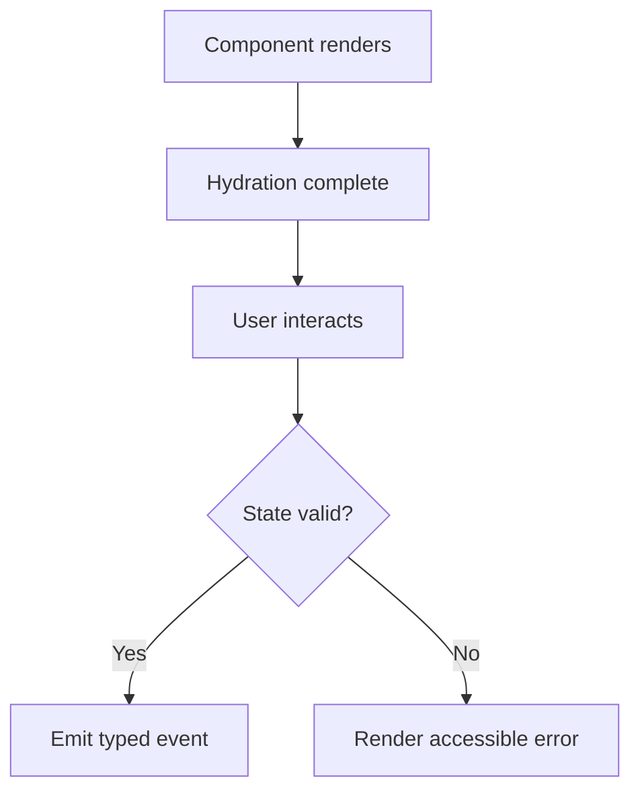
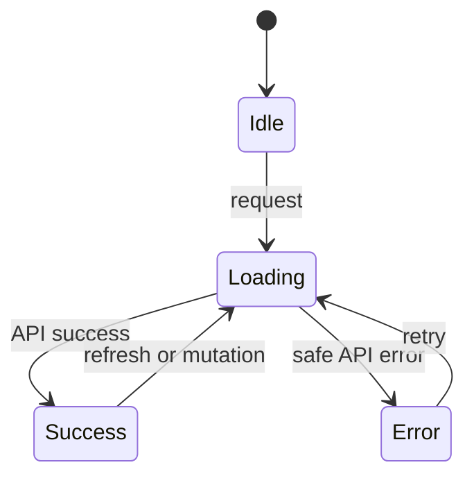

# Reusable UI Components Flowcharts

## FC-1: User interaction flow

```mermaid
flowchart TD
    A[Component renders] --> B[Hydration complete]
    B --> C[User interacts]
    C --> D{State valid?}
    D -- Yes --> E[Emit typed event]
    D -- No --> X[Render accessible error]
```

## FC-2: API state flow

```mermaid
stateDiagram-v2
    [*] --> Idle
    Idle --> Loading: request
    Loading --> Success: API success
    Loading --> Error: safe API error
    Error --> Loading: retry
    Success --> Loading: refresh or mutation
```

