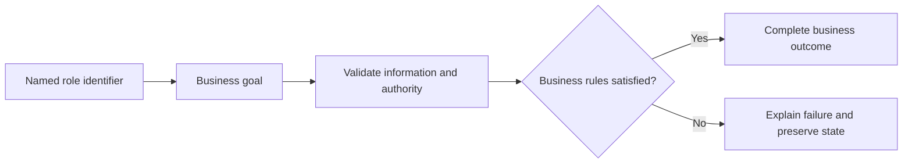

# User Management Use Cases

## Personas

| Persona | Role | Responsibility |
|---|---|---|
| Customer X | Visitor | Participates in authorized scenarios for this module. |
| System Actor X | Automated System Actor | Participates in authorized scenarios for this module. |
| Administrator X | Administrator | Participates in authorized scenarios for this module. |
| Customer Y | Customer | Participates in authorized scenarios for this module. |

## Use-case catalog

| ID | Name | Primary actor | Business outcome |
|---|---|---|---|
| UC-1 | Create a customer account | Customer X - Visitor | The requested business outcome is completed and visible to the authorized actor. |
| UC-2 | Authenticate and issue a JWT | System Actor X - Automated System Actor | The requested business outcome is completed and visible to the authorized actor. |
| UC-3 | List users for administration | Administrator X - Administrator | The requested business outcome is completed and visible to the authorized actor. |
| UC-4 | View one user | Administrator X - Administrator | The requested business outcome is completed and visible to the authorized actor. |
| UC-5 | List agency staff, optionally by role | Administrator X - Administrator | The requested business outcome is completed and visible to the authorized actor. |
| UC-6 | Update a user profile | Administrator X - Administrator | The requested business outcome is completed and visible to the authorized actor. |
| UC-7 | Import multiple employees | Administrator X - Administrator | The requested business outcome is completed and visible to the authorized actor. |
| UC-8 | Change role and branch assignment | Administrator X - Administrator | The requested business outcome is completed and visible to the authorized actor. |
| UC-9 | Create an employee account | Administrator X - Administrator | The requested business outcome is completed and visible to the authorized actor. |
| UC-10 | Deactivate a user without deleting history | Administrator X - Administrator | The requested business outcome is completed and visible to the authorized actor. |
| UC-11 | Find users by application role | Administrator X - Administrator | The requested business outcome is completed and visible to the authorized actor. |
| UC-12 | Send a reset link | Administrator X - Administrator | The requested business outcome is completed and visible to the authorized actor. |
| UC-13 | Consume a reset token and set a password | Administrator X - Administrator | The requested business outcome is completed and visible to the authorized actor. |
| UC-14 | Show wallet/account balance | Customer Y - Customer | The requested business outcome is completed and visible to the authorized actor. |
| UC-15 | Show wallet transaction history | Customer Y - Customer | The requested business outcome is completed and visible to the authorized actor. |

## UC-1: Create a customer account

### Description

This use case describes the business scenario for create a customer account. It explains the actor's objective, required business conditions, governing rules, expected outcome, and failure behavior. The description remains focused on business behavior and outcomes.

### Actor, preconditions, and trigger

- **Primary actor:** Customer X - Visitor
- **Preconditions:** dependencies are available; access is authorized; Validated `User` body is valid; referenced records exist.
- **Trigger:** Customer X chooses to create a customer account.

### Main success flow

1. The actor starts the business action.
2. The system validates the supplied business information.
3. Role, ownership, availability, and workflow rules are evaluated.
4. The requested business operation is completed.
5. Related business records remain consistent.
6. The outcome is shown to the authorized actor.

### Business rules

- Role, ownership, and workflow state are verified before mutation.

### Alternative and exception flows

1. Invalid input returns field feedback without mutation.
2. Unauthorized ownership returns access denied without protected data.
3. Missing records return the standard not-found response.
4. Workflow, concurrency, or dependency failure rolls back and returns a safe message.

### Postconditions

- **Success:** The requested business outcome is completed and visible to the authorized actor.
- **Failure:** no invalid, duplicate, unauthorized, or partial state remains.

### Case study

- **Scenario:** Layla registers and signs in with a unique account.
- **Example data:** customer.x@example.com; customer role.
- **Expected outcome:** A sanitized user/account and signed JWT are returned.
- **Failure example:** Duplicate identity or wrong credentials returns a safe error.
- **Business value:** Confirms realistic behavior, traceability, and data consistency.

---

## UC-2: Authenticate and issue a JWT

### Description

This use case describes the business scenario for authenticate and issue a jwt. It explains the actor's objective, required business conditions, governing rules, expected outcome, and failure behavior. The description remains focused on business behavior and outcomes.

### Actor, preconditions, and trigger

- **Primary actor:** System Actor X - Automated System Actor
- **Preconditions:** dependencies are available; access is authorized; Email/identifier and password map is valid; referenced records exist.
- **Trigger:** System Actor X chooses to authenticate and issue a jwt.

### Main success flow

1. The actor starts the business action.
2. The system validates the supplied business information.
3. Role, ownership, availability, and workflow rules are evaluated.
4. The requested business operation is completed.
5. Related business records remain consistent.
6. The outcome is shown to the authorized actor.

### Business rules

- Role, ownership, and workflow state are verified before mutation.

### Alternative and exception flows

1. Invalid input returns field feedback without mutation.
2. Unauthorized ownership returns access denied without protected data.
3. Missing records return the standard not-found response.
4. Workflow, concurrency, or dependency failure rolls back and returns a safe message.

### Postconditions

- **Success:** The requested business outcome is completed and visible to the authorized actor.
- **Failure:** no invalid, duplicate, unauthorized, or partial state remains.

### Case study

- **Scenario:** Layla registers and signs in with a unique account.
- **Example data:** customer.x@example.com; customer role.
- **Expected outcome:** A sanitized user/account and signed JWT are returned.
- **Failure example:** Duplicate identity or wrong credentials returns a safe error.
- **Business value:** Confirms realistic behavior, traceability, and data consistency.

---

## UC-3: List users for administration

### Description

This use case describes the business scenario for list users for administration. It explains the actor's objective, required business conditions, governing rules, expected outcome, and failure behavior. The description remains focused on business behavior and outcomes.

### Actor, preconditions, and trigger

- **Primary actor:** Administrator X - Administrator
- **Preconditions:** dependencies are available; access is authorized; None is valid; referenced records exist.
- **Trigger:** Administrator X chooses to list users for administration.

### Main success flow

1. The actor starts the business action.
2. The system validates the supplied business information.
3. Role, ownership, availability, and workflow rules are evaluated.
4. The requested business operation is completed.
5. Related business records remain consistent.
6. The outcome is shown to the authorized actor.

### Business rules

- Data is scoped to the authorized actor and feature boundary.

### Alternative and exception flows

1. Invalid input returns field feedback without mutation.
2. Unauthorized ownership returns access denied without protected data.
3. Missing records return the standard not-found response.
4. Workflow, concurrency, or dependency failure rolls back and returns a safe message.

### Postconditions

- **Success:** The requested business outcome is completed and visible to the authorized actor.
- **Failure:** no invalid, duplicate, unauthorized, or partial state remains.

### Case study

- **Scenario:** Layla registers and signs in with a unique account.
- **Example data:** customer.x@example.com; customer role.
- **Expected outcome:** A sanitized user/account and signed JWT are returned.
- **Failure example:** Duplicate identity or wrong credentials returns a safe error.
- **Business value:** Confirms realistic behavior, traceability, and data consistency.

---

## UC-4: View one user

### Description

This use case describes the business scenario for view one user. It explains the actor's objective, required business conditions, governing rules, expected outcome, and failure behavior. The description remains focused on business behavior and outcomes.

### Actor, preconditions, and trigger

- **Primary actor:** Administrator X - Administrator
- **Preconditions:** dependencies are available; access is authorized; User ID is valid; referenced records exist.
- **Trigger:** Administrator X chooses to view one user.

### Main success flow

1. The actor starts the business action.
2. The system validates the supplied business information.
3. Role, ownership, availability, and workflow rules are evaluated.
4. The requested business operation is completed.
5. Related business records remain consistent.
6. The outcome is shown to the authorized actor.

### Business rules

- Data is scoped to the authorized actor and feature boundary.

### Alternative and exception flows

1. Invalid input returns field feedback without mutation.
2. Unauthorized ownership returns access denied without protected data.
3. Missing records return the standard not-found response.
4. Workflow, concurrency, or dependency failure rolls back and returns a safe message.

### Postconditions

- **Success:** The requested business outcome is completed and visible to the authorized actor.
- **Failure:** no invalid, duplicate, unauthorized, or partial state remains.

### Case study

- **Scenario:** Layla registers and signs in with a unique account.
- **Example data:** customer.x@example.com; customer role.
- **Expected outcome:** A sanitized user/account and signed JWT are returned.
- **Failure example:** Duplicate identity or wrong credentials returns a safe error.
- **Business value:** Confirms realistic behavior, traceability, and data consistency.

---

## UC-5: List agency staff, optionally by role

### Description

This use case describes the business scenario for list agency staff, optionally by role. It explains the actor's objective, required business conditions, governing rules, expected outcome, and failure behavior. The description remains focused on business behavior and outcomes.

### Actor, preconditions, and trigger

- **Primary actor:** Administrator X - Administrator
- **Preconditions:** dependencies are available; access is authorized; Agency ID, optional `type` is valid; referenced records exist.
- **Trigger:** Administrator X chooses to list agency staff, optionally by role.

### Main success flow

1. The actor starts the business action.
2. The system validates the supplied business information.
3. Role, ownership, availability, and workflow rules are evaluated.
4. The requested business operation is completed.
5. Related business records remain consistent.
6. The outcome is shown to the authorized actor.

### Business rules

- Data is scoped to the authorized actor and feature boundary.

### Alternative and exception flows

1. Invalid input returns field feedback without mutation.
2. Unauthorized ownership returns access denied without protected data.
3. Missing records return the standard not-found response.
4. Workflow, concurrency, or dependency failure rolls back and returns a safe message.

### Postconditions

- **Success:** The requested business outcome is completed and visible to the authorized actor.
- **Failure:** no invalid, duplicate, unauthorized, or partial state remains.

### Case study

- **Scenario:** Layla registers and signs in with a unique account.
- **Example data:** customer.x@example.com; customer role.
- **Expected outcome:** A sanitized user/account and signed JWT are returned.
- **Failure example:** Duplicate identity or wrong credentials returns a safe error.
- **Business value:** Confirms realistic behavior, traceability, and data consistency.

---

## UC-6: Update a user profile

### Description

This use case describes the business scenario for update a user profile. It explains the actor's objective, required business conditions, governing rules, expected outcome, and failure behavior. The description remains focused on business behavior and outcomes.

### Actor, preconditions, and trigger

- **Primary actor:** Administrator X - Administrator
- **Preconditions:** dependencies are available; access is authorized; User ID and validated `User` is valid; referenced records exist.
- **Trigger:** Administrator X chooses to update a user profile.

### Main success flow

1. The actor starts the business action.
2. The system validates the supplied business information.
3. Role, ownership, availability, and workflow rules are evaluated.
4. The requested business operation is completed.
5. Related business records remain consistent.
6. The outcome is shown to the authorized actor.

### Business rules

- Role, ownership, and workflow state are verified before mutation.

### Alternative and exception flows

1. Invalid input returns field feedback without mutation.
2. Unauthorized ownership returns access denied without protected data.
3. Missing records return the standard not-found response.
4. Workflow, concurrency, or dependency failure rolls back and returns a safe message.

### Postconditions

- **Success:** The requested business outcome is completed and visible to the authorized actor.
- **Failure:** no invalid, duplicate, unauthorized, or partial state remains.

### Case study

- **Scenario:** Layla registers and signs in with a unique account.
- **Example data:** customer.x@example.com; customer role.
- **Expected outcome:** A sanitized user/account and signed JWT are returned.
- **Failure example:** Duplicate identity or wrong credentials returns a safe error.
- **Business value:** Confirms realistic behavior, traceability, and data consistency.

---

## UC-7: Import multiple employees

### Description

This use case describes the business scenario for import multiple employees. It explains the actor's objective, required business conditions, governing rules, expected outcome, and failure behavior. The description remains focused on business behavior and outcomes.

### Actor, preconditions, and trigger

- **Primary actor:** Administrator X - Administrator
- **Preconditions:** dependencies are available; access is authorized; Multipart file and `agencyId` is valid; referenced records exist.
- **Trigger:** Administrator X chooses to import multiple employees.

### Main success flow

1. The actor starts the business action.
2. The system validates the supplied business information.
3. Role, ownership, availability, and workflow rules are evaluated.
4. The requested business operation is completed.
5. Related business records remain consistent.
6. The outcome is shown to the authorized actor.

### Business rules

- Role, ownership, and workflow state are verified before mutation.

### Alternative and exception flows

1. Invalid input returns field feedback without mutation.
2. Unauthorized ownership returns access denied without protected data.
3. Missing records return the standard not-found response.
4. Workflow, concurrency, or dependency failure rolls back and returns a safe message.

### Postconditions

- **Success:** The requested business outcome is completed and visible to the authorized actor.
- **Failure:** no invalid, duplicate, unauthorized, or partial state remains.

### Case study

- **Scenario:** Layla registers and signs in with a unique account.
- **Example data:** customer.x@example.com; customer role.
- **Expected outcome:** A sanitized user/account and signed JWT are returned.
- **Failure example:** Duplicate identity or wrong credentials returns a safe error.
- **Business value:** Confirms realistic behavior, traceability, and data consistency.

---

## UC-8: Change role and branch assignment

### Description

This use case describes the business scenario for change role and branch assignment. It explains the actor's objective, required business conditions, governing rules, expected outcome, and failure behavior. The description remains focused on business behavior and outcomes.

### Actor, preconditions, and trigger

- **Primary actor:** Administrator X - Administrator
- **Preconditions:** dependencies are available; access is authorized; User ID, `type`, optional `branchId` is valid; referenced records exist.
- **Trigger:** Administrator X chooses to change role and branch assignment.

### Main success flow

1. The actor starts the business action.
2. The system validates the supplied business information.
3. Role, ownership, availability, and workflow rules are evaluated.
4. The requested business operation is completed.
5. Related business records remain consistent.
6. The outcome is shown to the authorized actor.

### Business rules

- Role, ownership, and workflow state are verified before mutation.

### Alternative and exception flows

1. Invalid input returns field feedback without mutation.
2. Unauthorized ownership returns access denied without protected data.
3. Missing records return the standard not-found response.
4. Workflow, concurrency, or dependency failure rolls back and returns a safe message.

### Postconditions

- **Success:** The requested business outcome is completed and visible to the authorized actor.
- **Failure:** no invalid, duplicate, unauthorized, or partial state remains.

### Case study

- **Scenario:** Layla registers and signs in with a unique account.
- **Example data:** customer.x@example.com; customer role.
- **Expected outcome:** A sanitized user/account and signed JWT are returned.
- **Failure example:** Duplicate identity or wrong credentials returns a safe error.
- **Business value:** Confirms realistic behavior, traceability, and data consistency.

---

## UC-9: Create an employee account

### Description

This use case describes the business scenario for create an employee account. It explains the actor's objective, required business conditions, governing rules, expected outcome, and failure behavior. The description remains focused on business behavior and outcomes.

### Actor, preconditions, and trigger

- **Primary actor:** Administrator X - Administrator
- **Preconditions:** dependencies are available; access is authorized; Validated `User` is valid; referenced records exist.
- **Trigger:** Administrator X chooses to create an employee account.

### Main success flow

1. The actor starts the business action.
2. The system validates the supplied business information.
3. Role, ownership, availability, and workflow rules are evaluated.
4. The requested business operation is completed.
5. Related business records remain consistent.
6. The outcome is shown to the authorized actor.

### Business rules

- Role, ownership, and workflow state are verified before mutation.

### Alternative and exception flows

1. Invalid input returns field feedback without mutation.
2. Unauthorized ownership returns access denied without protected data.
3. Missing records return the standard not-found response.
4. Workflow, concurrency, or dependency failure rolls back and returns a safe message.

### Postconditions

- **Success:** The requested business outcome is completed and visible to the authorized actor.
- **Failure:** no invalid, duplicate, unauthorized, or partial state remains.

### Case study

- **Scenario:** Layla registers and signs in with a unique account.
- **Example data:** customer.x@example.com; customer role.
- **Expected outcome:** A sanitized user/account and signed JWT are returned.
- **Failure example:** Duplicate identity or wrong credentials returns a safe error.
- **Business value:** Confirms realistic behavior, traceability, and data consistency.

---

## UC-10: Deactivate a user without deleting history

### Description

This use case describes the business scenario for deactivate a user without deleting history. It explains the actor's objective, required business conditions, governing rules, expected outcome, and failure behavior. The description remains focused on business behavior and outcomes.

### Actor, preconditions, and trigger

- **Primary actor:** Administrator X - Administrator
- **Preconditions:** dependencies are available; access is authorized; User ID is valid; referenced records exist.
- **Trigger:** Administrator X chooses to deactivate a user without deleting history.

### Main success flow

1. The actor starts the business action.
2. The system validates the supplied business information.
3. Role, ownership, availability, and workflow rules are evaluated.
4. The requested business operation is completed.
5. Related business records remain consistent.
6. The outcome is shown to the authorized actor.

### Business rules

- Role, ownership, and workflow state are verified before mutation.

### Alternative and exception flows

1. Invalid input returns field feedback without mutation.
2. Unauthorized ownership returns access denied without protected data.
3. Missing records return the standard not-found response.
4. Workflow, concurrency, or dependency failure rolls back and returns a safe message.

### Postconditions

- **Success:** The requested business outcome is completed and visible to the authorized actor.
- **Failure:** no invalid, duplicate, unauthorized, or partial state remains.

### Case study

- **Scenario:** Layla registers and signs in with a unique account.
- **Example data:** customer.x@example.com; customer role.
- **Expected outcome:** A sanitized user/account and signed JWT are returned.
- **Failure example:** Duplicate identity or wrong credentials returns a safe error.
- **Business value:** Confirms realistic behavior, traceability, and data consistency.

---

## UC-11: Find users by application role

### Description

This use case describes the business scenario for find users by application role. It explains the actor's objective, required business conditions, governing rules, expected outcome, and failure behavior. The description remains focused on business behavior and outcomes.

### Actor, preconditions, and trigger

- **Primary actor:** Administrator X - Administrator
- **Preconditions:** dependencies are available; access is authorized; `UserTypeEnum` is valid; referenced records exist.
- **Trigger:** Administrator X chooses to find users by application role.

### Main success flow

1. The actor starts the business action.
2. The system validates the supplied business information.
3. Role, ownership, availability, and workflow rules are evaluated.
4. The requested business operation is completed.
5. Related business records remain consistent.
6. The outcome is shown to the authorized actor.

### Business rules

- Data is scoped to the authorized actor and feature boundary.

### Alternative and exception flows

1. Invalid input returns field feedback without mutation.
2. Unauthorized ownership returns access denied without protected data.
3. Missing records return the standard not-found response.
4. Workflow, concurrency, or dependency failure rolls back and returns a safe message.

### Postconditions

- **Success:** The requested business outcome is completed and visible to the authorized actor.
- **Failure:** no invalid, duplicate, unauthorized, or partial state remains.

### Case study

- **Scenario:** Layla registers and signs in with a unique account.
- **Example data:** customer.x@example.com; customer role.
- **Expected outcome:** A sanitized user/account and signed JWT are returned.
- **Failure example:** Duplicate identity or wrong credentials returns a safe error.
- **Business value:** Confirms realistic behavior, traceability, and data consistency.

---

## UC-12: Send a reset link

### Description

This use case describes the business scenario for send a reset link. It explains the actor's objective, required business conditions, governing rules, expected outcome, and failure behavior. The description remains focused on business behavior and outcomes.

### Actor, preconditions, and trigger

- **Primary actor:** Administrator X - Administrator
- **Preconditions:** dependencies are available; access is authorized; Email and base URL is valid; referenced records exist.
- **Trigger:** Administrator X chooses to send a reset link.

### Main success flow

1. The actor starts the business action.
2. The system validates the supplied business information.
3. Role, ownership, availability, and workflow rules are evaluated.
4. The requested business operation is completed.
5. Related business records remain consistent.
6. The outcome is shown to the authorized actor.

### Business rules

- Role, ownership, and workflow state are verified before mutation.

### Alternative and exception flows

1. Invalid input returns field feedback without mutation.
2. Unauthorized ownership returns access denied without protected data.
3. Missing records return the standard not-found response.
4. Workflow, concurrency, or dependency failure rolls back and returns a safe message.

### Postconditions

- **Success:** The requested business outcome is completed and visible to the authorized actor.
- **Failure:** no invalid, duplicate, unauthorized, or partial state remains.

### Case study

- **Scenario:** Layla registers and signs in with a unique account.
- **Example data:** customer.x@example.com; customer role.
- **Expected outcome:** A sanitized user/account and signed JWT are returned.
- **Failure example:** Duplicate identity or wrong credentials returns a safe error.
- **Business value:** Confirms realistic behavior, traceability, and data consistency.

---

## UC-13: Consume a reset token and set a password

### Description

This use case describes the business scenario for consume a reset token and set a password. It explains the actor's objective, required business conditions, governing rules, expected outcome, and failure behavior. The description remains focused on business behavior and outcomes.

### Actor, preconditions, and trigger

- **Primary actor:** Administrator X - Administrator
- **Preconditions:** dependencies are available; access is authorized; Identifier, token, base number, new password is valid; referenced records exist.
- **Trigger:** Administrator X chooses to consume a reset token and set a password.

### Main success flow

1. The actor starts the business action.
2. The system validates the supplied business information.
3. Role, ownership, availability, and workflow rules are evaluated.
4. The requested business operation is completed.
5. Related business records remain consistent.
6. The outcome is shown to the authorized actor.

### Business rules

- Role, ownership, and workflow state are verified before mutation.

### Alternative and exception flows

1. Invalid input returns field feedback without mutation.
2. Unauthorized ownership returns access denied without protected data.
3. Missing records return the standard not-found response.
4. Workflow, concurrency, or dependency failure rolls back and returns a safe message.

### Postconditions

- **Success:** The requested business outcome is completed and visible to the authorized actor.
- **Failure:** no invalid, duplicate, unauthorized, or partial state remains.

### Case study

- **Scenario:** Layla registers and signs in with a unique account.
- **Example data:** customer.x@example.com; customer role.
- **Expected outcome:** A sanitized user/account and signed JWT are returned.
- **Failure example:** Duplicate identity or wrong credentials returns a safe error.
- **Business value:** Confirms realistic behavior, traceability, and data consistency.

---

## UC-14: Show wallet/account balance

### Description

This use case describes the business scenario for show wallet/account balance. It explains the actor's objective, required business conditions, governing rules, expected outcome, and failure behavior. The description remains focused on business behavior and outcomes.

### Actor, preconditions, and trigger

- **Primary actor:** Customer Y - Customer
- **Preconditions:** dependencies are available; access is authorized; User ID is valid; referenced records exist.
- **Trigger:** Customer Y chooses to show wallet/account balance.

### Main success flow

1. The actor starts the business action.
2. The system validates the supplied business information.
3. Role, ownership, availability, and workflow rules are evaluated.
4. The requested business operation is completed.
5. Related business records remain consistent.
6. The outcome is shown to the authorized actor.

### Business rules

- Data is scoped to the authorized actor and feature boundary.

### Alternative and exception flows

1. Invalid input returns field feedback without mutation.
2. Unauthorized ownership returns access denied without protected data.
3. Missing records return the standard not-found response.
4. Workflow, concurrency, or dependency failure rolls back and returns a safe message.

### Postconditions

- **Success:** The requested business outcome is completed and visible to the authorized actor.
- **Failure:** no invalid, duplicate, unauthorized, or partial state remains.

### Case study

- **Scenario:** Layla registers and signs in with a unique account.
- **Example data:** customer.x@example.com; customer role.
- **Expected outcome:** A sanitized user/account and signed JWT are returned.
- **Failure example:** Duplicate identity or wrong credentials returns a safe error.
- **Business value:** Confirms realistic behavior, traceability, and data consistency.

---

## UC-15: Show wallet transaction history

### Description

This use case describes the business scenario for show wallet transaction history. It explains the actor's objective, required business conditions, governing rules, expected outcome, and failure behavior. The description remains focused on business behavior and outcomes.

### Actor, preconditions, and trigger

- **Primary actor:** Customer Y - Customer
- **Preconditions:** dependencies are available; access is authorized; User ID is valid; referenced records exist.
- **Trigger:** Customer Y chooses to show wallet transaction history.

### Main success flow

1. The actor starts the business action.
2. The system validates the supplied business information.
3. Role, ownership, availability, and workflow rules are evaluated.
4. The requested business operation is completed.
5. Related business records remain consistent.
6. The outcome is shown to the authorized actor.

### Business rules

- Data is scoped to the authorized actor and feature boundary.

### Alternative and exception flows

1. Invalid input returns field feedback without mutation.
2. Unauthorized ownership returns access denied without protected data.
3. Missing records return the standard not-found response.
4. Workflow, concurrency, or dependency failure rolls back and returns a safe message.

### Postconditions

- **Success:** The requested business outcome is completed and visible to the authorized actor.
- **Failure:** no invalid, duplicate, unauthorized, or partial state remains.

### Case study

- **Scenario:** Layla registers and signs in with a unique account.
- **Example data:** customer.x@example.com; customer role.
- **Expected outcome:** A sanitized user/account and signed JWT are returned.
- **Failure example:** Duplicate identity or wrong credentials returns a safe error.
- **Business value:** Confirms realistic behavior, traceability, and data consistency.

## Use-case overview

