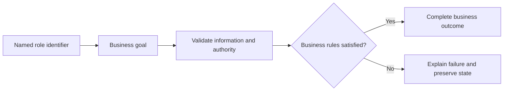

# Platform Services Use Cases

## Personas

| Persona | Role | Responsibility |
|---|---|---|
| System Actor X | Automated System Actor | Participates in authorized scenarios for this module. |

## Use-case catalog

| ID | Name | Primary actor | Business outcome |
|---|---|---|---|
| UC-1 | Shared only by other feature services | System Actor X - Automated System Actor | The requested business outcome is completed and visible to the authorized actor. |

## UC-1: Shared only by other feature services

### Description

This use case describes the business scenario for shared only by other feature services. It explains the actor's objective, required business conditions, governing rules, expected outcome, and failure behavior. The description remains focused on business behavior and outcomes.

### Actor, preconditions, and trigger

- **Primary actor:** System Actor X - Automated System Actor
- **Preconditions:** dependencies are available; access is authorized; Typed internal call is valid; referenced records exist.
- **Trigger:** System Actor X chooses to shared only by other feature services.

### Main success flow

1. The actor starts the business action.
2. The system validates the supplied business information.
3. Role, ownership, availability, and workflow rules are evaluated.
4. The requested business operation is completed.
5. Related business records remain consistent.
6. The outcome is shown to the authorized actor.

### Business rules

- Role, ownership, and workflow state are verified before mutation.

### Alternative and exception flows

1. Invalid input returns field feedback without mutation.
2. Unauthorized ownership returns access denied without protected data.
3. Missing records return the standard not-found response.
4. Workflow, concurrency, or dependency failure rolls back and returns a safe message.

### Postconditions

- **Success:** The shared capability completes and the authorized business feature receives its result.
- **Failure:** no invalid, duplicate, unauthorized, or partial state remains.

### Case study

- **Scenario:** The actor performs shared only by other feature services with realistic feature data.
- **Example data:** Representative typed input from the owning business feature.
- **Expected outcome:** Authorized state is returned or committed and displayed.
- **Failure example:** Invalid input or dependency failure leaves no partial state.
- **Business value:** Confirms realistic behavior, traceability, and data consistency.

## Use-case overview

