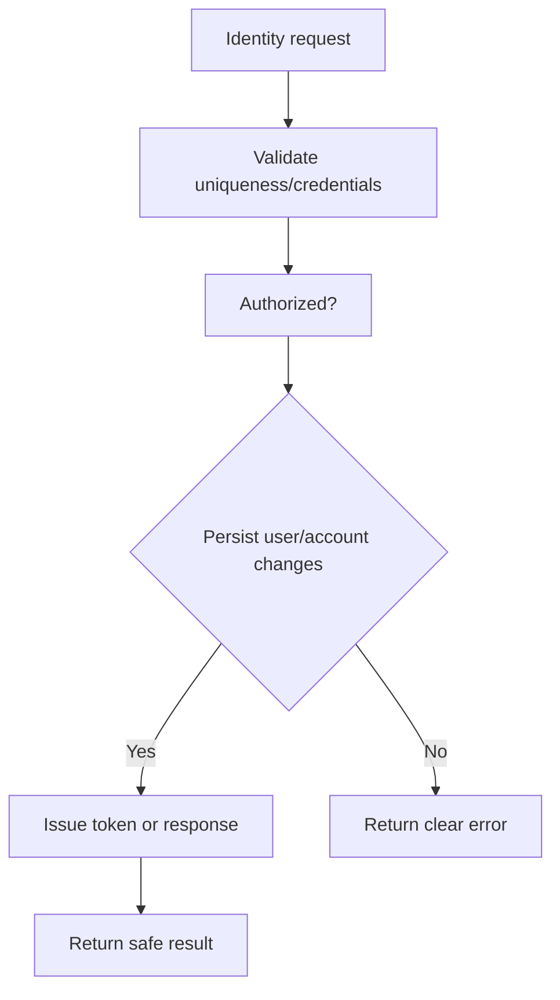
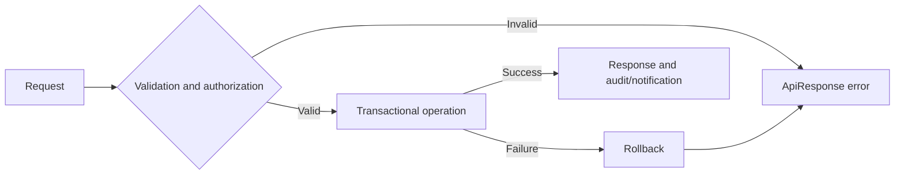

# User, Authentication, and Account Management Flowcharts

## FC-1: Primary flow

```mermaid
flowchart TD
    A[Identity request] --> B[Validate uniqueness/credentials]
    B --> C[Authorized?]
    C --> D{Persist user/account changes}
    D -- Yes --> E[Issue token or response]
    E --> F[Return safe result]
    D -- No --> X[Return clear error]
```

## FC-2: Failure handling

```mermaid
flowchart LR
    R[Request] --> V{Validation and authorization}
    V -- Invalid --> E[ApiResponse error]
    V -- Valid --> T[Transactional operation]
    T -->|Failure| B[Rollback]
    B --> E
    T -->|Success| S[Response and audit/notification]
```

